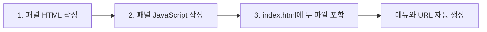

# 관리자 대시보드 패널 작성 예시

이 예시는 현재 기수에서 비활성 상태인 수강생을 보여주는 `비활성 수강생` 패널을 추가한다. 기존 저장소의 구성원 데이터만 읽으므로 API와 저장소 명령은 변경하지 않는다.

전체 규칙은 [관리자 대시보드 패널 작성 가이드](../manager-dashboard-panel-guide.md)에서 확인한다.

## 완성 후 결과

| 항목 | 값 |
|---|---|
| 메뉴명 | 비활성 수강생 |
| URL | `/manager-dashboard?panel=inactive-members` |
| 패널 키 | `inactiveMembers` |
| 표시 데이터 | 현재 기수의 `INACTIVE`, `ENDED` 수강생 |
| 새 파일 | HTML 1개, JavaScript 1개 |
| 기존 파일 수정 | `templates/manager/dashboard/index.html` 1개 |

작업 순서는 다음 세 단계다.



## 1. 패널 HTML 작성

다음 파일을 새로 만든다.

```text
src/main/resources/templates/manager/dashboard/panels/inactiveMembers.html
```

전체 내용은 다음과 같다.

```html
<section class="dashboard-panel"
         data-dashboard-panel="inactiveMembers"
         th:fragment="panel">
    <div class="panel-heading">
        <div>
            <span>소속 관리</span>
            <h2>비활성 수강생</h2>
        </div>
        <span class="count-badge" data-inactive-member-count>0명</span>
    </div>

    <div class="table-wrap">
        <table>
            <thead>
            <tr>
                <th>이름</th>
                <th>이메일</th>
                <th>상태</th>
            </tr>
            </thead>
            <tbody data-inactive-member-list></tbody>
        </table>
    </div>
</section>
```

핵심은 패널 키를 두 곳에서 동일하게 사용하는 것이다.

```text
파일명: inactiveMembers.html
DOM 키: data-dashboard-panel="inactiveMembers"
```

`is-active` 클래스는 레지스트리가 관리하므로 HTML에 직접 작성하지 않는다.

## 2. 패널 JavaScript 작성

다음 파일을 새로 만든다.

```text
src/main/resources/static/js/manager/dashboard/panels/inactiveMembersPanel.js
```

전체 내용은 다음과 같다.

```javascript
(() => {
    function create({ root, store, statusLabel, escapeHtml }) {
        if (!root) throw new Error("Inactive members panel root is required.");

        const count = root.querySelector("[data-inactive-member-count]");
        const list = root.querySelector("[data-inactive-member-list]");

        function getInactiveMembers() {
            return store.getState().currentCohort.members.filter((member) => (
                member.role === "STUDENT"
                && ["INACTIVE", "ENDED"].includes(member.status)
            ));
        }

        function activate() {
            const members = getInactiveMembers();
            count.textContent = `${members.length}명`;
            list.innerHTML = members.length
                ? members.map((member) => `
                    <tr>
                        <td><strong>${escapeHtml(member.name)}</strong></td>
                        <td>${escapeHtml(member.email)}</td>
                        <td><span class="status-badge">${statusLabel(member.status)}</span></td>
                    </tr>`).join("")
                : `<tr><td class="empty-row" colspan="3">비활성 수강생이 없습니다.</td></tr>`;
        }

        return Object.freeze({ activate });
    }

    window.OmagotchiDashboardPanels.register({
        key: "inactiveMembers",
        route: "inactive-members",
        label: "비활성 수강생",
        order: 45,
        topics: ["members", "selection"],
        create
    });
})();
```

### 코드가 나뉘는 이유

| 코드 | 역할 |
|---|---|
| `create()` | 패널의 DOM과 의존성을 한 번 준비한다. |
| `getInactiveMembers()` | 현재 기수에서 표시할 수강생만 선택한다. |
| `activate()` | 패널이 열리거나 관련 데이터가 변경될 때 화면을 그린다. |
| `register()` | 메뉴명, URL, 순서와 관심 데이터를 레지스트리에 알린다. |

`topics`에 선언한 값도 패널 이름이 아니라 이 패널이 읽는 데이터다.

- `members`: 구성원 상태가 변경되면 다시 렌더링한다.
- `selection`: 관리 기수가 변경되면 다시 렌더링한다.

이 패널은 차트, 타이머, 비동기 요청이 없으므로 `deactivate()`와 `invalidate()`가 필요하지 않다.

## 3. index.html에 포함

다음 파일에서 HTML 조각과 JavaScript를 한 줄씩 추가한다.

```text
src/main/resources/templates/manager/dashboard/index.html
```

패널 HTML 영역에서는 `members` 다음에 추가한다.

```html
<th:block th:replace="~{manager/dashboard/panels/members :: panel}"></th:block>
<th:block th:replace="~{manager/dashboard/panels/inactiveMembers :: panel}"></th:block>
<th:block th:replace="~{manager/dashboard/panels/attendance :: panel}"></th:block>
```

스크립트 영역에서도 `membersPanel.js` 다음에 추가한다.

```html
<script src="/js/manager/dashboard/panels/membersPanel.js"
        th:src="@{/js/manager/dashboard/panels/membersPanel.js}"></script>
<script src="/js/manager/dashboard/panels/inactiveMembersPanel.js"
        th:src="@{/js/manager/dashboard/panels/inactiveMembersPanel.js}"></script>
<script src="/js/manager/dashboard/panels/attendancePanel.js"
        th:src="@{/js/manager/dashboard/panels/attendancePanel.js}"></script>
```

여기까지 작성하면 `order: 45`에 따라 `소속 관리`와 `출결 관리` 사이에 메뉴가 자동으로 생성된다.

## 수정하지 않는 파일

이 예시에서는 다음 파일을 수정하지 않는다.

- `dashboardPanelRegistry.js`: 새 패널이 직접 `register()`하므로 수정하지 않는다.
- `dashboardStore.js`: 기존 `members` 데이터만 읽으므로 수정하지 않는다.
- `index.js`: 기존에 전달하는 `store`, `statusLabel`, `escapeHtml`만 사용한다.
- `layouts/layout.html`: 메뉴는 레지스트리가 자동으로 생성한다.
- `managerDashboard.css`: 기존 표와 상태 스타일을 재사용한다.
- `api.js`: 외부 데이터 연결이 없다.
- 테스트 소스: 기존 동작 검증만 실행한다.

## 확인 방법

### 1. JavaScript 구문 확인

```bash
node --check src/main/resources/static/js/manager/dashboard/panels/inactiveMembersPanel.js
git diff --check
```

### 2. 애플리케이션 실행

```bash
./mvnw spring-boot:run
```

브라우저에서 다음 내용을 확인한다.

- `비활성 수강생` 메뉴가 `소속 관리`와 `출결 관리` 사이에 표시된다.
- 메뉴를 누르면 URL이 `?panel=inactive-members`로 변경된다.
- 새로고침해도 같은 패널이 열린다.
- 뒤로가기와 앞으로가기가 정상 동작한다.
- 다른 기수를 선택하면 해당 기수의 비활성 수강생이 표시된다.
- 비활성 수강생이 없으면 빈 상태 문구가 표시된다.
- 브라우저 콘솔에 새 오류가 없다.

### 3. 기존 테스트 실행

```bash
./mvnw test
```

이 예시를 실제로 추가할 때 별도 테스트 코드가 필요하다면 작성 전에 허락을 받는다.

## 최종 변경 범위

```text
신규  templates/manager/dashboard/panels/inactiveMembers.html
신규  static/js/manager/dashboard/panels/inactiveMembersPanel.js
수정  templates/manager/dashboard/index.html
```

새 패널을 추가했지만 공통 레지스트리, 저장소, 진입점과 레이아웃은 그대로 유지된다.
