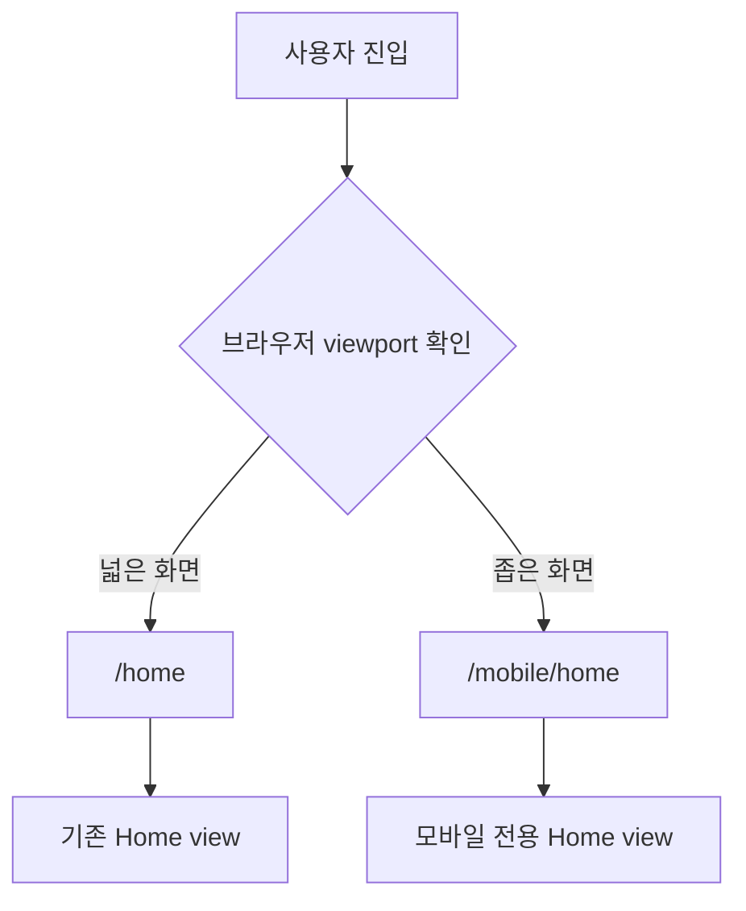
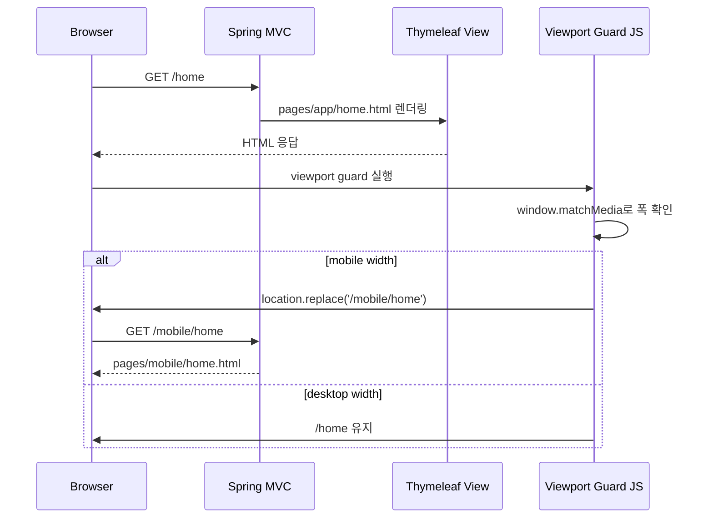
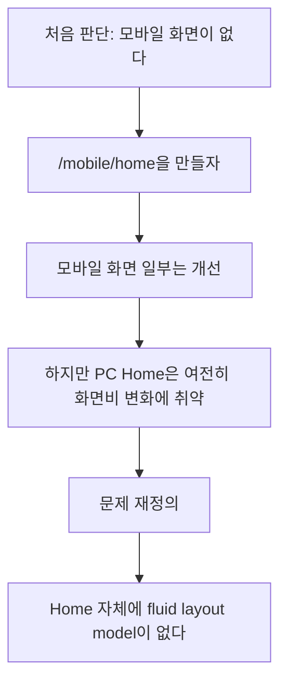
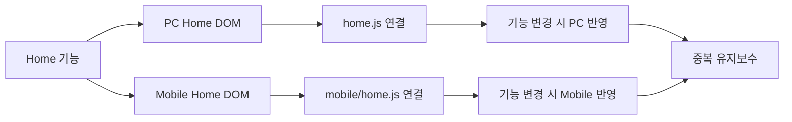
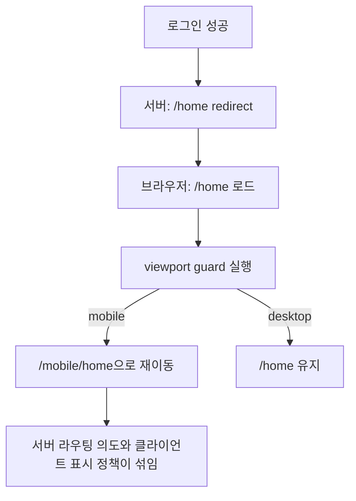
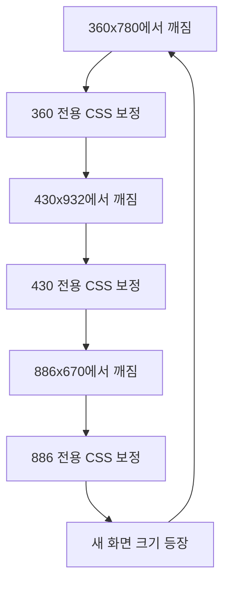
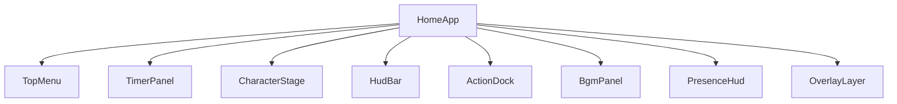
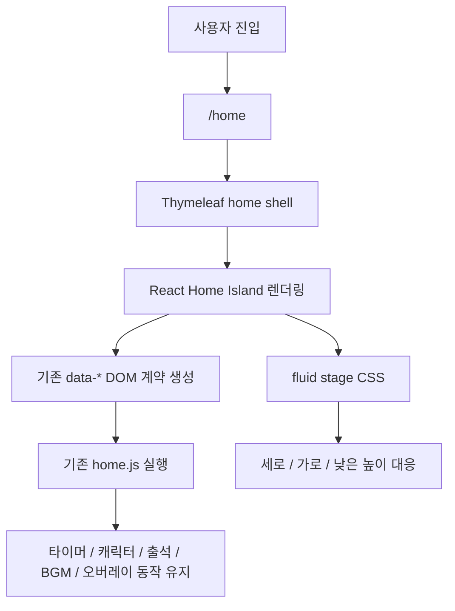
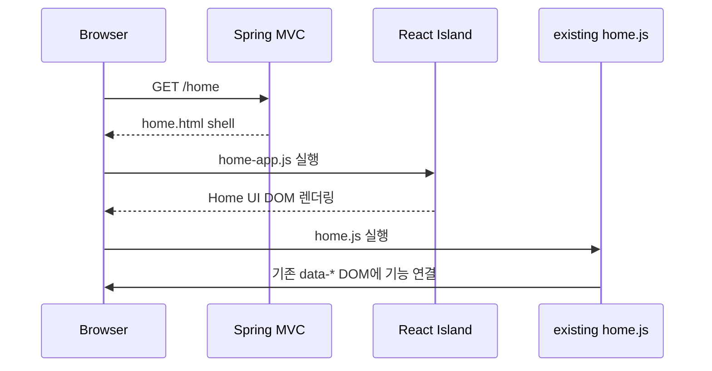

# Home UI 전환 검토 기록

- 상태: 작업 기록 — 현재 결정은 관련 ADR과 구현 코드에서 확인

## 목적

이 문서는 Home 화면을 모바일과 다양한 화면 비율에 대응시키기 위해 어떤 방향을 검토했는지, 처음에는 왜 모바일 전용 분리를 고려했는지, 이후 왜 React Island와 `/home` 단일 진입점 방향으로 판단을 바꿨는지 기록한다.

핵심 결론은 다음과 같다.

- 문제의 본질은 모바일 전용 페이지 부재가 아니라 Home UI의 확장성 부족이었다.
- 기기별 viewport 값을 따라가는 방식은 유지보수성이 낮다.
- `/mobile/home`처럼 Home을 경로 단위로 분리하면 핵심 기능 표현이 두 벌로 갈라진다.
- 최종적으로는 `/home` 단일 진입점에서 React Island와 fluid stage 방식으로 Home UI를 재구성하는 방향이 더 적합하다고 판단했다.

## 처음 문제로 본 것

초기에는 모바일에서 Home 화면이 보기 좋지 않은 문제가 가장 눈에 띄었다.

관찰된 문제는 다음과 같았다.

- 데스크톱 Home은 넓은 화면에서는 그럭저럭 보였다.
- 모바일 세로 화면에서는 상단 메뉴, 타이머, 캐릭터, 하단 HUD가 한 화면에 안정적으로 들어오지 않았다.
- 모바일 가로 화면이나 태블릿 크기에서는 데스크톱도 모바일도 아닌 어중간한 배치가 나왔다.
- 브라우저 창을 대각선으로 늘리거나 줄이면 요소들이 각자 다른 기준으로 움직였다.
- 특정 viewport 하나에서 맞춘 CSS가 다른 viewport에서는 다시 깨졌다.

그래서 처음에는 문제를 이렇게 해석했다.

> 데스크톱 화면은 그대로 두고, 모바일 화면만 별도로 만들면 된다.

이 해석 때문에 `/mobile/home` 같은 모바일 전용 화면을 먼저 고려했다.

## React 이전에 고려했던 1차 방향

처음 계획은 Spring MVC + Thymeleaf 구조를 유지한 채 모바일 전용 view를 추가하는 것이었다.

예상 구조는 다음과 같았다.

이 방식의 기대 효과는 명확했다.

- 기존 데스크톱 Home을 크게 건드리지 않아도 된다.
- 모바일 화면을 빠르게 실험할 수 있다.
- 모바일 전용 배치를 별도 CSS로 자유롭게 만들 수 있다.
- QA에서 `/mobile/home`만 직접 열어 확인하기 쉽다.

그래서 실제로 다음과 같은 시도를 했다.

- 모바일 전용 컨트롤러 추가
- 모바일 전용 Home 템플릿 추가
- 모바일 전용 Character Selector 템플릿 추가
- 모바일 전용 CSS와 JS 추가
- viewport 폭에 따라 `/home`과 `/mobile/home`을 오가게 하는 client-side redirect 시도

## 원래 생각했던 분기 방식

초기 분기 아이디어는 브라우저 viewport 폭을 기준으로 화면을 나누는 방식이었다.

서버는 사용자의 실제 브라우저 크기를 알 수 없으므로, 클라이언트에서 먼저 viewport를 판단하고 필요한 경우 경로를 바꾸는 방식을 생각했다.

이 방식은 기술적으로는 가능했다. 하지만 실제 검토하면서 다음 문제가 생겼다.

## 왜 이 방향이 틀렸다고 판단했는가

### 1. 문제의 본질이 route 분리가 아니었다

실제 화면을 계속 확인해보니 모바일만 문제가 아니었다.

데스크톱 Home도 화면 비율이 바뀌면 어색해졌다. 즉 `/mobile/home`을 잘 만들어도 `/home` 자체가 다양한 화면 비율을 견디지 못하는 문제는 그대로 남았다.

### 2. Home 기능이 두 벌로 갈라진다

Home은 단순 소개 페이지가 아니라 서비스의 핵심 기능이 모인 화면이다.

- 타이머
- 캐릭터
- 경험치와 레벨
- 출석
- BGM
- 재실 인원
- 채팅
- 메뉴 오버레이

`/home`과 `/mobile/home`을 나누면 이 기능들의 표현과 DOM 계약을 두 벌로 관리해야 한다.

이 구조는 처음에는 빠르게 보이지만, 기능이 조금만 늘어나도 PC와 Mobile의 UI/JS/API 연결이 서로 어긋날 가능성이 크다.

### 3. viewport redirect는 책임 경계가 애매했다

로그인, 회원가입, 출석 완료 같은 흐름은 서버 인증과 페이지 라우팅에 가깝다. 그런데 클라이언트 viewport script가 중간에서 경로를 바꾸기 시작하면 다음과 같은 애매한 상태가 된다.

- 서버는 `/home`으로 보냈지만 브라우저가 `/mobile/home`으로 다시 이동한다.
- 화면 폭이 바뀌면 같은 사용자가 다른 경로에 있을 수 있다.
- 인증 흐름과 UI 표시 정책이 분리되지 않고 섞인다.
- `/home`이라는 핵심 진입점의 의미가 약해진다.

이 방식은 인증/인가 코드를 직접 바꾸지는 않더라도, 페이지 흐름을 클라이언트에서 다시 해석하게 만든다. 장기적으로는 추적하기 어려운 흐름이 될 가능성이 높다.

### 4. 기기별 하드코딩 방향으로 흘러갔다

처음에는 QA 기준으로 몇 가지 viewport를 정했다.

- 360 x 780
- 393 x 852
- 430 x 932
- 886 x 670

하지만 실제 구현 중에는 이 값들이 검증 샘플이 아니라 구현 기준처럼 사용되기 시작했다. 이러면 새 기기나 다른 브라우저 크기가 나올 때마다 새 CSS 보정이 필요해진다.

이 방식은 반응형 설계가 아니라 화면 크기 추적에 가깝다.

## React를 고려하게 된 이유

React를 고려한 이유는 단순히 최신 기술을 쓰기 위해서가 아니다.

Home 화면은 여러 UI 상태가 한 화면 안에서 동시에 움직인다. 기존 방식처럼 긴 HTML과 여러 `querySelector` 기반 JS가 커지면, UI 단위와 상태 단위가 서로 흩어진다.

React를 쓰면 다음 단위로 나눌 수 있다.

이 구조는 Home UI를 의미 단위로 관리하기 좋다.

오버레이도 같은 이유로 React 전환 대상이다. 현재는 기존 `home.js`의 문자열 템플릿과 이벤트 위임이 남아 있으므로 즉시 전부 옮기기보다, 먼저 시각 스타일과 화면 비율 대응을 정리하고 이후 도움말, 진행, 커뮤니티, 공간처럼 기능 단위로 React 컴포넌트화한다.

다만 기존 기능을 한 번에 React 상태로 옮기는 것은 위험하다고 판단했다. 이미 `home.js`에는 타이머, 캐릭터, 레벨, 출석, BGM, 재실 인원, 오버레이 동작이 들어 있기 때문이다.

그래서 전체 React 전환이 아니라 React Island 방식을 선택했다.

## 최종 선택한 방향

최종 방향은 다음과 같다.

핵심은 `/home`을 유지하면서 Home UI만 컴포넌트화하는 것이다.

서버 흐름은 그대로 둔다.

## 선택을 신뢰한 이유

이 판단을 신뢰한 이유는 다음과 같다.

첫째, Home은 서비스의 핵심 화면이므로 PC와 Mobile로 기능 표현을 두 벌 관리하면 장기 비용이 크다.

둘째, 문제는 특정 모바일 화면 하나가 아니라 Home 전체의 레이아웃 모델 문제였다. 따라서 `/mobile/home`을 잘 만드는 것보다 `/home` 자체를 확장 가능한 stage로 바꾸는 편이 더 근본적이다.

셋째, React Island는 기존 기능을 모두 버리지 않으면서 UI 구조만 먼저 정리할 수 있는 중간 단계다. 즉 리스크를 줄이면서도 다음 단계로 갈 수 있는 구조다.

넷째, 인증/인가/JWT/세션 같은 서버 소유 영역을 건드리지 않는다. 프론트 표현 계층 안에서만 문제를 해결한다.

## 폐기한 실험 산출물

다음 실험은 방향을 바꾸면서 제거했다.

- 모바일 전용 Home 컨트롤러
- 모바일 전용 Home 템플릿
- 모바일 전용 Character Selector 템플릿
- 모바일 전용 CSS
- 모바일 전용 JS
- viewport 기반 client-side route guard
- check-in 이후 viewport 기준 Home 이동 resolver

이 실험은 실패한 작업이라기보다, 문제를 더 정확히 정의하기 위한 탐색 단계였다. 결과적으로 이 시도를 통해 "모바일 페이지 분리"가 아니라 "Home 자체의 fluid stage화"가 필요하다는 판단에 도달했다.

## 앞으로의 작업 기준

앞으로 Home UI 작업은 다음 원칙을 따른다.

- `/home`을 단일 Home 진입점으로 유지한다.
- 기기 모델이나 특정 viewport 값 기준으로 구현하지 않는다.
- 화면 비율과 가용 공간 기준으로 레이아웃 모드를 나눈다.
- 기존 `home.js`의 DOM 계약을 깨지 않는다.
- React로 기능을 옮길 때는 UI 단위가 아니라 기능 단위로 작게 옮긴다.
- 오버레이는 `data-home-overlay` 진입 계약을 유지하고, 내부 화면은 React 컴포넌트와 API/helper 분리 구조로 점진 이전한다.
- 인증/인가/JWT/세션 흐름은 이 작업 범위에서 다루지 않는다.

## 관련 문서

- [Home UI React Island 리팩토링 기록](home-react-island-refactor.md)
- [React Island 학습·작업 로드맵](../../roadmaps/react-island-learning-roadmap.md)
