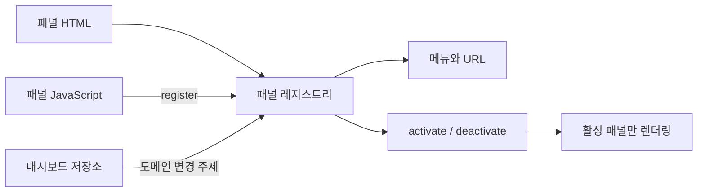

# 관리자 대시보드 패널 작성 가이드

> 적용 범위: `src/main/resources/**/manager/dashboard/` 관리자 대시보드
>
> 상태: 현재 구현 기준

이 문서는 관리자 대시보드 패널을 새로 만들거나 기존 패널을 수정할 때 지켜야 할 파일 위치, 패널 인터페이스와 검증 절차를 설명한다.

처음 작성한다면 [비활성 수강생 패널 작성 예시](examples/manager-dashboard-panel-example.md)를 먼저 확인한다.

## 먼저 확인할 원칙

- 한 패널의 HTML과 동작은 각각 해당 패널 파일 안에서 완결한다.
- 메뉴, URL과 활성 패널 생명주기는 패널 레지스트리가 담당한다.
- 공유 상태와 저장은 대시보드 저장소를 통해서만 변경한다.
- 패널은 자신이 관심 있는 도메인 변경 주제만 구독한다.
- 새 패널 때문에 `index.js`, 레이아웃 또는 저장소에 패널 목록을 만들지 않는다.
- 백엔드 연결 코드와 테스트 코드는 사전 허락 없이 작성하거나 수정하지 않는다.

## 구조 한눈에 보기



`index.html`은 패널 HTML과 스크립트를 조합하고, `index.js`는 공통 셸과 레지스트리 시작만 담당한다.

## 변경 내용에 따른 파일 위치

| 변경 내용 | 파일 위치 | 원칙 |
|---|---|---|
| 패널 화면 구조 | `templates/manager/dashboard/panels/{key}.html` | 패널 루트와 내부 마크업만 작성한다. |
| 패널 렌더링·이벤트 | `static/js/manager/dashboard/panels/{key}Panel.js` | 이벤트는 `create()`에서 한 번 연결한다. |
| 패널 포함·스크립트 로딩 | `templates/manager/dashboard/index.html` | HTML 조각과 스크립트를 각각 한 줄 추가한다. |
| 팝업·모달 | `templates/manager/dashboard/popups/`, `static/js/manager/dashboard/popups/` | 여러 패널과 분리된 생명주기가 필요할 때 사용한다. |
| 공유 상태·명령 | `static/js/manager/dashboard/dashboardStore.js` | 직접 저장하지 않고 명령으로 변경한다. |
| 메뉴·URL·생명주기 | `static/js/manager/dashboard/dashboardPanelRegistry.js` | 공통 동작 자체를 바꿀 때만 수정한다. |
| 공통 셸·의존성 조립 | `static/js/manager/dashboard/index.js` | 셸 렌더링과 패널에 외부 의존성을 연결하는 코드만 둔다. |
| 공통 레이아웃 | `templates/manager/dashboard/layouts/layout.html` | Header, Sidebar, 공통 Dialog만 둔다. |
| 스타일 | `static/css/managerDashboard.css` | 기존 공통 클래스를 우선 사용하고 패널별 구역을 구분한다. |

## 신규 패널 작성

### 1. 이름 결정

하나의 패널은 다음 이름을 일관되게 사용한다.

| 항목 | 규칙 | 예시 |
|---|---|---|
| `key` | `camelCase` | `learningAlerts` |
| `route` | `kebab-case` | `learning-alerts` |
| HTML 파일 | `{key}.html` | `learningAlerts.html` |
| JavaScript 파일 | `{key}Panel.js` | `learningAlertsPanel.js` |
| 패널 루트 | `data-dashboard-panel="{key}"` | `data-dashboard-panel="learningAlerts"` |

`key`와 `route`는 저장된 선택 상태와 URL에 사용되므로 배포 후 단순 표시명 변경 목적으로 바꾸지 않는다.

### 2. HTML 조각 작성

`templates/manager/dashboard/panels/{key}.html`에 패널 루트를 작성한다.

```html
<section class="dashboard-panel"
         data-dashboard-panel="learningAlerts"
         th:fragment="panel">
    <div class="panel-heading">
        <div>
            <span>학습 알림</span>
            <h2>확인이 필요한 학습 기록</h2>
        </div>
    </div>

    <div data-learning-alert-list></div>
</section>
```

- 패널 루트에는 `dashboard-panel`과 `data-dashboard-panel`을 지정한다.
- 신규 패널에 `is-active`를 직접 지정하지 않는다.
- JavaScript가 사용하는 요소는 의미가 드러나는 `data-*` 속성으로 찾는다.
- 다른 패널 내부의 요소를 참조하지 않는다.

### 3. 패널 모듈 작성

`static/js/manager/dashboard/panels/{key}Panel.js`에서 패널을 생성하고 자체 등록한다.

```javascript
(() => {
    function create({ root, store }) {
        if (!root) throw new Error("Learning alerts panel root is required.");

        const list = root.querySelector("[data-learning-alert-list]");

        function activate() {
            const state = store.getState();
            list.textContent = `${state.currentCohort.name} 학습 알림`;
        }

        return Object.freeze({ activate });
    }

    window.OmagotchiDashboardPanels.register({
        key: "learningAlerts",
        route: "learning-alerts",
        label: "학습 알림",
        order: 85,
        topics: ["learningAlerts", "selection"],
        create
    });
})();
```

패널 모듈은 전역 생성 함수를 별도로 노출하지 않고 `register()`만 호출한다.

### 4. 패널 포함

`templates/manager/dashboard/index.html`의 패널 영역에 HTML 조각을 추가한다.

```html
<th:block th:replace="~{manager/dashboard/panels/learningAlerts :: panel}"></th:block>
```

패널 스크립트 영역에는 레지스트리 뒤, `index.js` 앞에 스크립트를 추가한다.

```html
<script src="/js/manager/dashboard/panels/learningAlertsPanel.js"
        th:src="@{/js/manager/dashboard/panels/learningAlertsPanel.js}"></script>
```

메뉴 버튼은 레지스트리가 생성하므로 레이아웃에는 추가하지 않는다.

### 5. 상태 명령이 필요한 경우

화면 표시만 추가한다면 저장소를 수정하지 않는다. 공유 상태 변경이 필요할 때만 `dashboardStore.js`에 명령을 추가한다.

저장소가 발행하는 `changes`에는 화면 이름이 아니라 변경된 도메인 데이터를 작성한다.

```javascript
return commit(command.type, next, {
    changes: ["learningAlerts", "audits"]
});
```

- 올바른 예: `members`, `attendance`, `notices`, `learningAlerts`
- 잘못된 예: `overviewPanel`, `learningAlertsPanel`, `renderDashboard`

관련 데이터를 사용하는 패널만 같은 주제를 `topics`에 선언한다.

## 패널 인터페이스

### 등록 정보

| 속성 | 필수 | 역할 |
|---|---|---|
| `key` | 필수 | 패널과 DOM을 식별하는 고유 키 |
| `route` | 필수 | `/manager-dashboard?panel=`에 사용하는 값 |
| `label` | 필수 | Sidebar 메뉴 표시명 |
| `order` | 선택 | 메뉴 순서, 생략 시 `100` |
| `topics` | 선택 | 활성 패널을 다시 렌더링할 도메인 변경 주제 |
| `invalidateOn` | 선택 | 패널의 캐시를 무효화할 도메인 변경 주제 |
| `create` | 필수 | 패널 컨트롤러 생성 함수 |

`key`와 `route`는 다른 패널과 중복될 수 없다. 중복되거나 필수 값이 없으면 레지스트리 시작 전에 오류가 발생한다.

### 생명주기

| 메서드 | 필수 | 호출 시점 |
|---|---|---|
| `activate(context)` | 필수 | 패널 활성화 및 관련 상태 변경 후 렌더링 |
| `deactivate()` | 선택 | 다른 패널로 이동할 때 정리 |
| `invalidate()` | 선택 | 선언한 `invalidateOn` 주제가 변경될 때 캐시 제거 |

- `create()`는 페이지 로드 시 한 번 실행된다.
- 이벤트 핸들러는 `create()`에서 한 번만 등록한다.
- `activate()`는 여러 번 호출될 수 있으므로 같은 상태에서 반복 호출해도 안전해야 한다.
- 차트, 타이머나 진행 중 요청처럼 활성 상태에 종속된 자원이 있으면 `deactivate()`에서 정리한다.
- 다시 조회해야 하는 캐시 데이터가 있으면 `invalidate()`에서 무효화한다.

## 기존 패널 수정

| 수정 목적 | 우선 수정 위치 |
|---|---|
| 문구, 표, 입력 요소 변경 | 해당 패널 HTML |
| 렌더링, 검색, 정렬, 이벤트 변경 | 해당 패널 JavaScript |
| 패널이 사용하는 상태 변경 | 패널의 `topics` |
| 공유 상태 변경 규칙 추가 | `dashboardStore.js` 명령 |
| 메뉴명, URL, 순서 변경 | 해당 패널의 `register()` 정보 |
| 모든 패널의 전환 방식 변경 | `dashboardPanelRegistry.js` |
| 공통 Header, Sidebar, Dialog 변경 | `layouts/layout.html` |
| 패널 전용 팝업 변경 | 대응하는 `popups/` HTML과 JavaScript |

수정 범위가 두 개 이상의 패널로 퍼질 때만 공통 구현으로 올린다. 단일 패널에서만 사용하는 계산·표시 도우미는 해당 패널에 유지한다. 단, 외부 연결 함수처럼 조립이 필요한 의존성은 구현을 옮기지 않고 `index.js`에서 패널에 전달한다.

## 비동기 데이터와 외부 연결

- 패널은 외부 연결을 직접 생성하기보다 `create()`로 전달받은 함수를 사용한다.
- 느린 이전 요청이 최신 화면을 덮어쓰지 않도록 요청 순서 또는 취소 상태를 관리한다.
- 패널이 비활성화된 뒤에는 DOM이나 차트를 갱신하지 않는다.
- API 클라이언트, HTTP 요청, 프록시, 인증, SSE 또는 WebSocket 변경은 구현 전에 허락을 받는다.
- Mock 응답과 실제 백엔드 계약을 같은 것으로 간주하지 않는다.

## 스타일 작성

- 기존 레이아웃, 버튼, 표와 상태 클래스가 있으면 우선 재사용한다.
- 패널 전용 선택자는 패널 루트 아래로 범위를 제한한다.
- 고정 너비보다 `minmax()`, `%`, `min-width: 0`과 반응형 Grid를 우선한다.
- 차트 컨테이너는 부모 너비를 넘지 않도록 하고 Chart.js는 반응형 옵션을 유지한다.
- 현재는 `managerDashboard.css`를 사용한다. 별도 CSS 파일을 만들 경우 로딩 위치와 분리 기준을 먼저 합의한다.

## 금지하는 구조

- 모든 패널을 호출하는 `renderAll()` 또는 `renderDashboard()` 재도입
- 패널별 메뉴 목록을 레이아웃, 진입점과 저장소에 중복 선언
- 패널에서 `localStorage` 또는 `sessionStorage` 직접 변경
- 패널에서 `history`, `popstate` 또는 Sidebar 클릭 직접 처리
- 다른 패널의 DOM, 내부 상태 또는 비공개 함수 참조
- 저장소의 `changes`에 패널 파일명이나 렌더링 함수명 사용
- 이벤트가 발생할 때마다 동일한 핸들러를 다시 등록
- 허락 없는 백엔드 연결 코드 또는 테스트 코드 변경

## 검증 체크리스트

### 정적 확인

- [ ] 패널 `key`, `route`와 DOM 키가 일치한다.
- [ ] 신규 HTML 조각과 JavaScript가 `index.html`에 포함되어 있다.
- [ ] `topics`와 `invalidateOn`에 도메인 변경 주제만 사용한다.
- [ ] 공통 모듈에 패널 목록을 추가하지 않았다.
- [ ] 변경한 JavaScript가 `node --check`를 통과한다.
- [ ] `git diff --check`를 통과한다.

### 브라우저 확인

- [ ] 메뉴가 `order` 순서로 표시된다.
- [ ] 클릭 시 `?panel={route}`와 활성 패널이 일치한다.
- [ ] 새로고침 후 같은 패널이 복원된다.
- [ ] 뒤로가기와 앞으로가기가 정상 동작한다.
- [ ] 기수 변경 후 활성 패널만 올바르게 갱신된다.
- [ ] 다른 패널로 이동할 때 모달, 차트와 진행 중 상태가 정리된다.
- [ ] 좁은 화면에서 콘텐츠와 차트가 부모 영역을 넘지 않는다.
- [ ] 새로 발생한 브라우저 콘솔 오류가 없다.

### 프로젝트 확인

- [ ] 기존 `./mvnw test`를 실행한다.
- [ ] API 또는 테스트 코드 변경이 필요했다면 사전에 허락받았는지 확인한다.
- [ ] 가이드의 경로나 인터페이스가 달라졌다면 이 문서도 함께 갱신한다.
