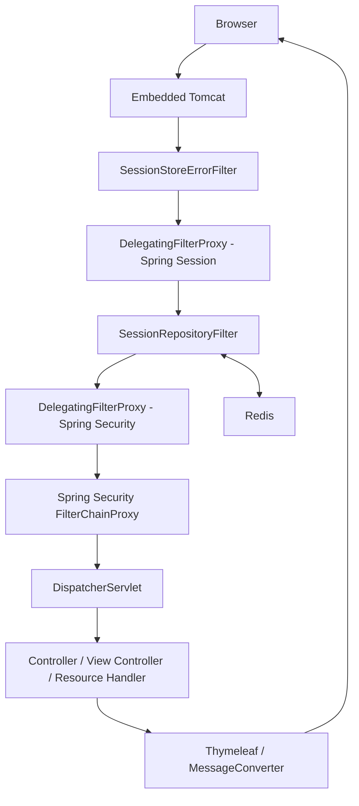
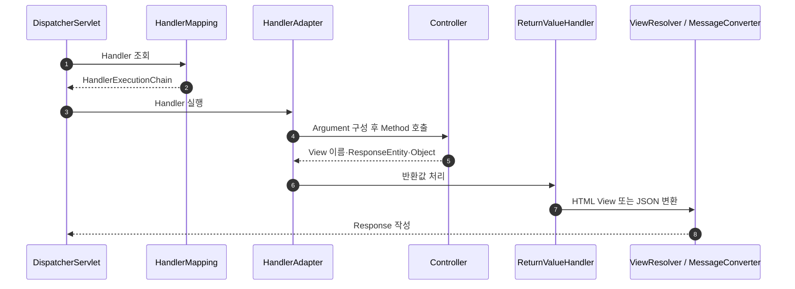

# Servlet Container와 Spring Container

> 상태: 현재 Frontend Runtime 설명 · Spring Boot 4.1·Spring Security 7.1·Spring Session 4.1 기준

## 1. Runtime 구성

| Runtime | 소유 대상 | 현재 구현 |
|---|---|---|
| Browser | DOM·Event·Cookie·Browser Storage·JavaScript | HTML·CSS·JS 실행 |
| Embedded Tomcat | TCP·HTTP·Servlet·Filter Chain | Spring Boot 내장 Server |
| Spring Container | Bean 생성·주입·설정·생명주기 | `ApplicationContext` |
| Spring MVC | Handler 선택·호출·View·JSON·MVC 예외 | `DispatcherServlet` |
| Spring Security | 인증·인가·CSRF·Logout·SecurityContext | `FilterChainProxy` |
| Spring Session | `HttpSession` 대체·Redis 저장 | `SessionRepositoryFilter` |

- 핵심 구분
  - Tomcat: HTTP 요청과 Servlet 실행
  - Spring Container: Application 객체와 설정 관리
  - Spring MVC: Controller·View 처리
  - Spring Security·Session: Servlet Filter 기반 요청 경계
  - Browser: Server 응답 이후 화면 실행

## 2. 기동 경계

```text
FrontendApplication.main(...)
→ SpringApplication.run(...)
→ ApplicationContext 생성
→ Component Scan·Configuration 처리
→ Bean 생성·주입
→ Embedded Tomcat 생성
→ Servlet·Filter 등록
→ Port Listen
```

- `FrontendApplication`
  - Spring Boot Bootstrap
  - `@ConfigurationPropertiesScan` 시작점
  - 업무 Bean 생성 책임 없음
- Spring Bean 예시
  - `SecurityFilterChain`
  - `LoginPageController`
  - `AuthenticationService`
  - `IdentityRestAuthClient`
  - `SessionStoreErrorFilter` 등록 설정
  - `SessionStoreFailureResponseWriter`
- Servlet Object 예시
  - `HttpServletRequest`
  - `HttpServletResponse`
  - `FilterChain`
  - 요청별 `HttpSession` Wrapper
- Browser Object 예시
  - `window`
  - `document`
  - DOM Element
  - `localStorage`·`sessionStorage`

## 3. 요청 경계



- `DelegatingFilterProxy`
  - Servlet Container Filter
  - Spring Session Proxy: `springSessionRepositoryFilter` Bean 위임
  - Spring Security Proxy: `springSecurityFilterChain` Bean 위임
  - Servlet Container와 Spring Container 사이의 연결 지점
- `SessionRepositoryFilter`
  - Spring Session의 Servlet Filter
  - `HttpServletRequest` Wrapper 적용
  - `getSession()`을 Redis 기반 Session Repository에 연결
- `DispatcherServlet`
  - Servlet Container 관점: `/` Mapping Servlet
  - Spring MVC 관점: Handler·View·Exception 처리 중앙 진입점

## 4. 현재 핵심 Filter 순서

```text
Tomcat Filter Chain
→ SessionStoreErrorFilter
→ DelegatingFilterProxy
  → SessionRepositoryFilter
→ DelegatingFilterProxy
  → FilterChainProxy
    → Spring Security 내부 Filter
→ DispatcherServlet
```

- `SessionStoreErrorFilter`
  - 등록: `SessionStoreConfig`
  - 순서: `SessionRepositoryFilter.DEFAULT_ORDER - 1`
  - 책임: Redis Session 연결 실패·명령 시간 초과 포착
- `SessionStoreFailureResponseWriter`
  - 의존성: Thymeleaf `ViewResolver`, `ServletApiErrorResponseWriter`
  - 책임: 기존 응답 초기화와 경로별 HTML·JSON 503 작성
- 직전 순서 필요성
  - Controller 전 Session 조회 실패 포착
  - MVC 반환 뒤 Session 저장 실패 포착
  - `ControllerAdvice` 바깥 실패 포착
- 비대상
  - 일반 Application 예외
  - 다른 Data Store의 Timeout
  - 이미 커밋된 응답

## 5. Spring Security 내부 경계

```text
DelegatingFilterProxy
→ FilterChainProxy
→ 현재 Request와 일치하는 SecurityFilterChain
→ SecurityContext·CSRF·Authorization·Form Login·Logout Filter
```

- 현재 주요 처리
  - Session의 SecurityContext 복원
  - 공개·보호 Route 판단
  - CSRF Token 생성·검증
  - `POST /login` Form 인증
  - `POST /logout` Session 정리
- `AuthenticatedLoginRequestFilter`
  - 적용 판단: `POST /login`만 확인
  - 다른 요청: SecurityContext 강제 조회 없는 즉시 통과
  - 인증 Session의 중복 Login: Identity 호출 전 `/home` Redirect
- Session 관리 Filter
  - Custom Session 전략 등록으로 전체 Security Chain에 포함
  - Session Cookie가 있는 정적 Resource에서도 Redis Session 조회 가능
  - 정적 Resource의 Redis 독립성: 현재 비보장
- Security 실패 위치
  - `DispatcherServlet` 이전
  - MVC `@ControllerAdvice` 비대상

## 6. Spring MVC 내부 경계



- `HandlerMapping`
  - `@GetMapping`·`@PostMapping`
  - `ViewControllerRegistry`
  - 정적 Resource Handler
- `HandlerAdapter`
  - 선택된 Controller Method 호출
  - Form Binding·Validation·Servlet Argument 제공
- `ViewResolver`
  - View 이름의 Thymeleaf Template 변환
- `HttpMessageConverter`
  - `@RequestBody`·`@ResponseBody` JSON 변환
- `HandlerExceptionResolver`
  - MVC 내부 예외의 응답 변환
  - Servlet Filter 예외 처리 불가

## 7. Handler 유형

### 단순 View Controller

```text
GET /home
→ WebConfig의 View Controller
→ View 이름 pages/app/home
→ templates/pages/app/home.html
```

- 사용 조건
  - 요청별 Server Model 없음
  - Application 호출 없음
  - View 선택 분기 없음

### Page Controller

```text
GET /login
→ LoginPageController
→ 인증 상태·실패 Query 판단
→ login View 또는 /home Redirect
```

- 특징
  - `@Controller`
  - Form Model·View·Redirect 처리
  - 미처리 `BusinessException`의 HTML 오류 변환

### REST Controller

- 현재 Production 수: 0
- 향후 역할
  - 기능별 BFF JSON Endpoint
  - `ApiExceptionHandler` 적용 대상
- 비보장
  - Controller 선택 전 404·405·415
  - Security·Session Filter 오류

### 정적 Resource Handler

```text
GET /css/error.css
→ Security 정적 Resource 허용
→ DispatcherServlet
→ ResourceHttpRequestHandler
→ File Response
```

## 8. Session 저장 시점

```text
표준 Servlet 코드
request.getSession()
session.setAttribute(...)

Runtime
HttpServletRequest
→ SessionRepositoryFilter Wrapper
→ Redis Session 조회·생성
→ Attribute 변경 추적
→ 요청 종료 시 Redis 저장
```

- Browser Cookie
  - 역할: Redis Session ID 전달
  - 이름: `SESSION_COOKIE_NAME` 설정값
  - 로컬 예시: `OMAGOTCHI_SESSION`
  - 내용: Access·Refresh Token 아님
- 저장 대상
  - Spring Security `SecurityContext`
  - `BrowserSessionTokenBundle`
  - CSRF 상태
- 저장 주체 구분
  - `BrowserTokenSessionAuthenticationStrategy`: Token Bundle을 `HttpSession` attribute에 기록
  - Form Login Filter: SecurityContext Repository에 Context 저장
  - `SessionRepositoryFilter`: 요청 종료 시 Session 변경을 Redis에 반영
- 실패 경계
  - Session Attribute 기록 성공 뒤 Redis 저장 실패 가능
  - Login 성공 응답 작성 뒤 저장 실패 가능
  - Refresh Token Family 보상 미구현

## 9. 대표 요청

### `GET /home`

```text
Browser
→ SessionStoreErrorFilter
→ SessionRepositoryFilter
  → Cookie Session ID의 Redis 조회
→ Spring Security
  → SecurityContext 복원
  → authenticated() 확인
→ DispatcherServlet
→ WebConfig View Controller
→ Thymeleaf home.html
→ SessionRepositoryFilter의 Redis 저장
→ Browser
```

### `POST /login`

```text
Browser Form + CSRF
→ SessionStoreErrorFilter
→ SessionRepositoryFilter
→ Spring Security
  → CSRF 검증
  → AuthenticatedLoginRequestFilter
  → UsernamePasswordAuthenticationFilter
  → IdentityLoginAuthenticationProvider
  → Identity Login HTTP 호출
  → Session ID 교체
  → Token Bundle의 HttpSession 기록
  → Login 전 CSRF Token 폐기
  → SecurityContext 저장
  → /home Redirect
→ SessionRepositoryFilter의 Redis 저장
```

### `POST /logout`

```text
Browser Form + CSRF
→ Spring Security LogoutFilter
→ IdentityLogoutHandler의 Refresh Token 폐기 시도
→ 기본 Logout Handler의 Session·SecurityContext·CSRF 정리
→ /login Redirect
→ SessionRepositoryFilter의 Redis 반영
```

### Redis 미접속 요청

```text
SessionRepositoryFilter의 조회·저장 실패
→ 바깥 SessionStoreErrorFilter
→ /bff/v1/**: 공통 JSON 503
→ 그 외 Page: error/5xx View 직접 렌더링
```

## 10. 예외 도달 범위

| 발생 위치 | DispatcherServlet 진입 | 처리 경계 |
|---|---:|---|
| Tomcat HTTP Parsing | 전 | Tomcat |
| Spring Session 조회 | 전 | `SessionStoreErrorFilter` |
| Spring Security 인증·인가 | 전 | Security Handler |
| Handler Mapping·Controller | 내부 | MVC Resolver·Advice |
| Thymeleaf Rendering | 내부 | MVC Resolver·Boot `/error` |
| Spring Session 저장 | 반환 뒤 가능 | `SessionStoreErrorFilter` |

- `ApiExceptionHandler`
  - 선택된 `@RestController` 예외 전용
  - JSON 응답
- `BffApiExceptionResolver`
  - `/bff/v1/**`의 Mapping·표현 협상 404·405·406·415
  - JSON 응답
- `PageBusinessExceptionHandler`
  - REST JSON 처리 이후 남은 `BusinessException`
  - HTML View 응답
- Boot `/error`
  - 처리되지 않은 Page 오류
  - `sendError(...)`의 ERROR Dispatch

## 11. Thread와 동기 호출

```text
Tomcat Request Thread
→ Filter Chain
→ DispatcherServlet
→ Controller
→ AuthenticationService
→ IdentityRestAuthClient
→ 동기 HTTP 대기
→ 역순 반환
```

- 현재 모델
  - Spring MVC 동기 처리
  - HTTP Service Client의 동기 `RestClient`
- Singleton Bean 제약
  - 여러 Request Thread의 동시 사용
  - 요청별 변경 상태의 Instance Field 저장 금지
- 실제 Network 경계
  - Redis
  - Identity Service

## 12. Test Runtime

| Test | 실제 경계 | 비보장 |
|---|---|---|
| `MockMvc` | Spring MVC·선택적 Security Filter | 실제 TCP·Tomcat 없음 |
| `@WebMvcTest` | 제한된 MVC Slice | Redis·전체 Bean 없음 |
| `@SpringBootTest` + MockMvc | 전체 Context | Filter 비활성화 시 Security 비보장 |
| RANDOM_PORT Integration | 실제 Tomcat·TCP·Filter 순서 | 외부 Service Test Double 가능 |
| Testcontainers Redis | 실제 Redis Session 저장·복원 | 운영 Redis 구성 전체 아님 |

- 핵심 통합 Test
  - `BrowserSessionRedisIntegrationTest`
  - `SessionStoreFailureIntegrationTest`
- 실행 조건
  - Docker 호환 Container Runtime
  - Sandbox 밖 Local Socket 허용

## 13. 참고

- [Spring Framework: DispatcherServlet](https://docs.spring.io/spring-framework/reference/web/webmvc/mvc-servlet.html)
- [Spring Session: HttpSession Integration](https://docs.spring.io/spring-session/reference/http-session.html)
- [Spring Security: Servlet Architecture](https://docs.spring.io/spring-security/reference/servlet/architecture.html)
- 주요 Code
  - [`SessionStoreConfig.java`](../../src/main/java/site/omagotchi/frontend/global/session/SessionStoreConfig.java)
  - [`SessionStoreErrorFilter.java`](../../src/main/java/site/omagotchi/frontend/global/session/SessionStoreErrorFilter.java)
  - [`SecurityConfig.java`](../../src/main/java/site/omagotchi/frontend/global/security/SecurityConfig.java)
  - [`WebConfig.java`](../../src/main/java/site/omagotchi/frontend/global/config/WebConfig.java)
