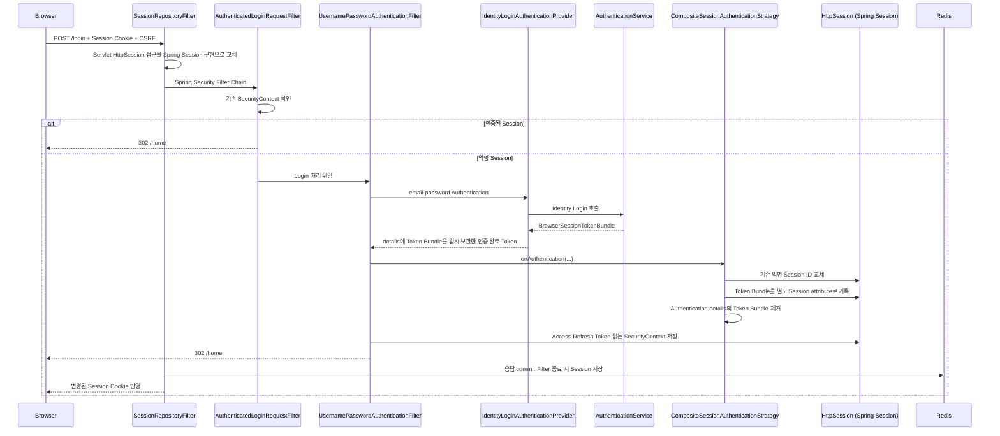
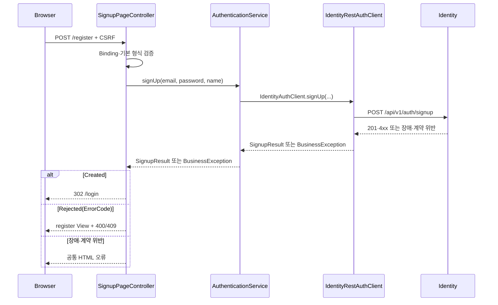
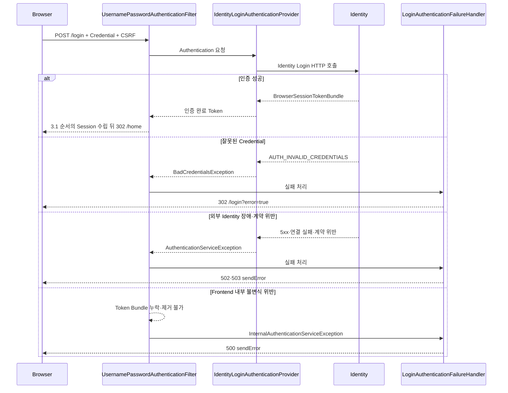
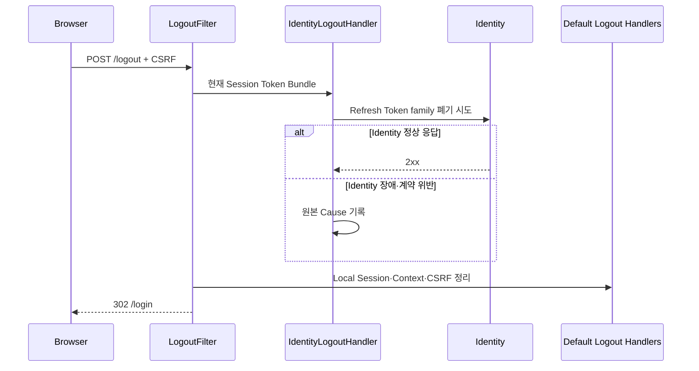

# Session 인증 흐름

> 상태: Signup·Login·Logout·BFF 공통 JSON 경계 구현 · 기능별 BFF·Refresh·관리자 권한 미구현

## 1. 인증 경계

```text
Browser
→ 설정된 Opaque Session Cookie
→ Frontend Spring Security·Spring MVC
→ AuthenticationService
→ IdentityAuthClient
→ Identity Service

Identity Access·Refresh Token
→ Frontend HttpSession attribute
→ Spring Session Redis

Browser
← Session Cookie만 수신
```

- Browser ↔ Frontend
  - Opaque Session Cookie
  - 로컬 이름 예시: `OMAGOTCHI_SESSION`
  - Access·Refresh Token 원문 미노출
- Frontend ↔ Identity
  - Signup·Login·Logout 내부 HTTP 호출
  - Browser 사용자 Credential과 별도인 Frontend Basic Credential
- Frontend ↔ Domain Service
  - 현재 기능별 호출 없음
  - Browser 계약: `/bff/v1/**`
  - 목표: Session Access JWT의 Bearer 전달
  - 목표 경로: Discovery·Client-side Load Balancing 기반 직접 내부 호출
- Gateway
  - 외부 `/api/**`·Webhook 경계
  - Frontend BFF 내부 호출의 필수 중계자 아님

## 2. 인증 Route

| 기능 | Browser 요청 | 처리 경계 |
|---|---|---|
| Signup Page | `GET /register` | `SignupPageController` |
| Signup 제출 | `POST /register` | `SignupPageController` |
| Login Page | `GET /login` | `LoginPageController` |
| Login 제출 | `POST /login` | Spring Security Form Login |
| Logout | `POST /logout` | Spring Security Logout Filter |

- 별도 JSON 인증 API
  - 현재 없음
  - 과거 `/session/v1/**` 제거 완료
- 관리자 인증
  - 공통 `/login` 사용
  - 별도 `/manager-login`·`/manager-register` Route 없음

## 3. Type 책임

| 경계 | Type | 책임 |
|---|---|---|
| Page | `LoginPageController` | Login View·실패 안내·인증 사용자 Redirect |
| Page | `SignupPageController` | Signup Form·Identity 가입·View 복구 |
| Page | `SignupForm` | 필수값·기본 이메일 형식 |
| Security | `AuthenticatedLoginRequestFilter` | 인증 Session의 중복 Login 차단 |
| Security | `IdentityLoginAuthenticationProvider` | Form Credential의 Identity 검증 |
| Security | `LoginAuthenticationFailureHandler` | Credential 실패 Redirect·장애 상태 처리 |
| Security | `BrowserTokenSessionAuthenticationStrategy` | Session ID 교체 뒤 Token Bundle 기록·SecurityContext 비밀값 제거 |
| Security | `BrowserSessionTokens` | Token Bundle Session attribute 접근 |
| Security | `IdentityLogoutHandler` | Identity Refresh Token 폐기 시도 |
| Application | `AuthenticationService` | Presentation과 Identity Port 사이의 Use Case 경계 |
| Port | `IdentityAuthClient` | Signup·Login·Logout Application 계약 |
| Infrastructure | `IdentityRestAuthClient` | Identity HTTP 응답의 Application 결과·실패 변환 |

- Spring Security 확장점 분리 사유
  - Provider: Credential 검증 시점
  - Failure Handler: Login 실패 응답 시점
  - Session Strategy: 인증 성공 뒤·SecurityContext 저장 전 HttpSession 처리 시점
  - Logout Handler: Local Session 정리 전 외부 폐기 시점

### 3.1 Login 성공 뒤 Session 수립 순서

- `SessionAuthenticationStrategy`
  - 별도 인증 방식 아님
  - `UsernamePasswordAuthenticationFilter`의 Provider 인증 성공 직후 HttpSession 후처리 확장점
  - Token Bundle의 HttpSession 이동과 SecurityContext 비밀값 제거를 위한 처리 시점



#### Login 성공 전후 저장 구조

```text
Provider 인증 성공 직후 UsernamePasswordAuthenticationToken
├── principal: userId
├── authorities: ROLE_USER 또는 ROLE_SYSTEM_ADMIN
├── credentials: null
└── details: BrowserSessionTokenBundle  ← Session Strategy 전달용 임시 위치

Session Strategy 실행 뒤 HttpSession
├── SPRING_SECURITY_CONTEXT
│   └── SecurityContext
│       └── UsernamePasswordAuthenticationToken
│           ├── principal: userId
│           ├── authorities: ROLE_...
│           ├── credentials: null
│           └── details: null
└── BrowserSessionTokens 전용 attribute
    └── BrowserSessionTokenBundle
        ├── Access Token·만료 시각
        └── Refresh Token·만료 시각

Spring Session
└── 위 HttpSession attribute 전체를 Redis에 저장

Browser
└── Redis 값이 아닌 Opaque Session ID Cookie만 보관
```

- `BrowserSessionTokenBundle`과 `UsernamePasswordAuthenticationToken`
  - 서로 다른 객체
  - 전자: Domain Service 호출·Logout에 필요한 Identity Token 묶음
  - 후자: 현재 사용자의 인증 여부·Principal·Authority를 나타내는 Spring Security 객체
- Page Controller의 `Principal` 인자
  - Spring MVC가 `HttpServletRequest#getUserPrincipal()`에서 주입하는 현재 사용자 식별자
  - 미인증 요청의 `null`
  - 인증 요청의 사용자 UUID 문자열
  - Login·Signup Page의 인증 사용자 `/home` Redirect 판단
- `HttpSession attribute`
  - Servlet API의 `HttpSession#setAttribute(key, value)` 저장값
  - HTTP Request attribute·HTML attribute와 다른 Server Session 상태
  - Spring Session 적용 뒤에도 동일한 Servlet API 사용
  - 실제 저장소 선택만 Spring Session Redis 구현에 위임
- `Authentication.details`
  - 인증 요청의 부가 정보용 자리
  - 표준적인 비밀값 저장소 아님
  - 현재 구현에서는 Provider와 Session Strategy 사이의 Token Bundle 임시 전달에만 사용
- `details` 제거
  - Spring Security 필수 요구사항 아님
  - Token Bundle의 별도 Session attribute 저장 완료 뒤 수행하는 Frontend 보안 정책
  - SecurityContext와 Token Bundle attribute의 중복 저장 방지
  - 인증·인가 정보와 Domain Service 호출 Credential의 저장 위치 분리
- `SecurityContext` 저장
  - 다음 요청의 로그인 상태 복원에 필요한 Session 정보
  - Principal·Authority를 가진 `Authentication` 보관
  - “Token 없음”의 의미: Authentication 부재가 아닌 Access·Refresh Token 부재

- `SessionRepositoryFilter`
  - Spring Security보다 앞에서 `HttpServletRequest#getSession()`을 Redis 기반 `HttpSession`으로 교체
  - Cookie의 Session ID 조회와 Redis 저장은 Session 접근·응답 commit·Filter 종료에 수행
- `AuthenticatedLoginRequestFilter`
  - 인증된 Session의 재제출을 `/home`으로 Redirect
  - Identity 재호출과 Refresh Token Family 추가 발급 차단
- `IdentityLoginAuthenticationProvider`
  - `SecurityConfig`의 단일 `ProviderManager`에 명시적 등록
  - Identity 성공값을 `UsernamePasswordAuthenticationToken`으로 변환
  - Access·Refresh Token은 `details`에 잠시만 보관
- `CompositeSessionAuthenticationStrategy`
  - 여러 `SessionAuthenticationStrategy` 구현의 순차 실행기
  - `ChangeSessionIdAuthenticationStrategy`: 기존 익명 Session이 있으면 Session fixation 방어용 ID 교체
  - `BrowserTokenSessionAuthenticationStrategy`: Token Bundle attribute 기록 뒤 `details` 제거
- `Strategy`의 의미
  - Spring Security가 정의한 인증 성공 후 HttpSession 처리 확장 인터페이스
  - 인증 성공 여부를 결정하는 `AuthenticationProvider`와 다른 역할
  - Session ID 교체·동시 Session 제어·Application 전용 Session 기록 등의 교체 가능한 처리 정책
  - 현재 Frontend의 조합: Session ID 교체 → Token Bundle 저장·`details` 제거
- `SecurityContext` 저장
  - Principal·전역 Role만 저장
  - Token Bundle 제거 뒤 저장하므로 SecurityContext 직렬화 대상 제외
- `SessionRepositoryFilter` 저장
  - Token Bundle attribute와 SecurityContext를 Redis Session으로 반영
  - Redis 저장 실패는 인증 성공으로 전환하지 않는 장애 경계

## 4. CSRF

```text
GET Form Page
→ Spring Security CSRF Token 생성
→ 익명 HttpSession 기록
→ Thymeleaf hidden _csrf input

POST Form
→ Session Cookie + _csrf 제출
→ CsrfFilter 검증
→ Signup·Login·Logout 처리
```

- 적용 대상
  - Signup
  - Login
  - Logout
- 별도 CSRF 조회 API
  - 현재 불필요
- 향후 JSON BFF
  - 실제 Endpoint 추가 시 Header 전달 정책 결정

## 5. Signup



- Frontend 검증
  - 필수 필드
  - 기본 이메일 형식
  - Form 오류 표시
- Identity 검증
  - 이름·이메일 허용 정책
  - 비밀번호 정책
  - 이메일 중복
  - 실제 계정 생성 가능 여부
- 계정 결과
  - 일반 `USER` 계정 생성
  - 기수 `MANAGER` 소속 생성 없음
- Application 결과
  - `Created`: Login Page Redirect
  - `Rejected(ErrorCode)`: 동일 Form 복구에 사용할 Frontend 공개 오류
    - `COMMON_INVALID_REQUEST`: Identity 필수값 검증 실패
    - `ACCOUNT_INVALID_EMAIL`: 이메일 정책 위반
    - `ACCOUNT_INVALID_PASSWORD`: 비밀번호 정책 위반
    - `ACCOUNT_INVALID_NAME`: 이름 정책 위반
    - `ACCOUNT_DUPLICATE_EMAIL`: 이메일 중복
- 예외 유지
  - Identity 5xx·연결 장애: 503 `BusinessException`
  - 응답 계약 위반: 502 `BusinessException`

## 6. Login



- Credential 실패
  - Identity `AUTH_INVALID_CREDENTIALS`
  - `BadCredentialsException`
  - `/login?error=true` Redirect
- Identity 장애·계약 위반
  - `AuthenticationServiceException`
  - 해당 Login 요청의 실패이지만 사용자 Credential 오류나 Frontend 내부 오류의 의미는 아님
  - 외부 Identity 장애·계약 위반으로 로그인 처리가 끝나지 않은 상태
  - 사용자 Credential 오류와 구분한 502·503 `sendError`
  - 현재 `UsernamePasswordAuthenticationToken` 지원 Provider는 Identity Provider 하나
  - 다른 Provider를 추가하면 `AuthenticationServiceException`만으로 Provider 순회 중단 보장 없음
- Frontend 내부 인증 오류
  - `InternalAuthenticationServiceException`
  - Token Bundle 누락·제거 불가처럼 Frontend가 만든 인증 성공값의 불변식 위반
  - Spring Security 로그인 실패 처리와 Failure Handler로 전달
  - SecurityContext·성공 Redirect·인증 Cookie 수립 없는 실패 종료
- 중복 Login
  - 대상: 인증된 Session의 `POST /login`
  - 결과: Identity 재호출 없는 `/home` Redirect
  - 목적: 기존 Token Family 보존
- Session fixation 방어
  - `ChangeSessionIdAuthenticationStrategy`
  - Login 전·후 Session ID 교체

## 7. Redis Session 저장 내용

- Spring Security Context
  - 사용자 UUID Principal
  - 전역 Role Authority
  - Credential 원문 없음
  - Token Bundle details 없음
- `BrowserSessionTokenBundle`
  - 사용자 UUID
  - 전역 Role
  - Access Token·만료 시각
  - Refresh Token·만료 시각
- 저장 시점
  - Login Strategy: HttpSession attribute 기록
  - Security Filter: SecurityContext 저장
  - Spring Session Filter: 응답 commit 또는 Filter 종료 시 Redis 반영
- Browser 노출 금지
  - HTML
  - JavaScript
  - Cookie
  - Log 문자열

## 8. Logout



- Frontend 정책
  - Identity 폐기 시도 우선
  - Identity 결과와 무관한 Local Logout 계속
  - Redis Session 장애는 바깥 503 처리를 위한 재전파
- Identity 계약 기대
  - 이미 없거나 폐기된 Refresh Token의 멱등 성공
  - 최종 근거: Identity 현재 API 계약·Test
- Browser 정책
  - Logout 성공: Tab 단위 Prototype 표시 상태 제거와 Login Page 이동
  - 이미 만료된 Session의 `401`·`403`: 표시 상태 제거와 Login Page 이동
  - `5xx`·Network 실패: 표시 상태 유지와 현재 화면의 실패 안내
  - Server 완료 전 Logout 성공으로 보이는 화면 전환 금지

## 9. Identity HTTP 경계

```text
AuthenticationService
→ IdentityAuthClient
→ IdentityRestAuthClient
→ RestClientCallExecutor
→ IdentityAuthHttpService
→ HTTP Service Client Group
→ Identity Service
```

- `IdentityAuthHttpService`
  - Method·Path·Request·Response Wire 계약
- `IdentityAuthHttpServiceConfig`
  - `identity-service` Group
  - Frontend Basic Credential
- `IdentityRestAuthClient`
  - 호출별 성공 HTTP 상태·Body 검증
  - 호출별 공개 4xx 제한
  - Signup 4xx의 `SignupResult` 변환
  - 현재 작업 중단 실패의 `BusinessException` 변환
- `IdentityAuthErrorResolver`
  - Identity 4xx 공통 오류 Body 해석
  - 호출별 공개 Code·HTTP 상태 계약 검증
  - 검증된 Frontend `ErrorCode` 반환
- `RestClientCallExecutor`
  - Discovery·연결·Timeout·5xx 공통 처리
  - 4xx 호출별 결과 복구·예외 변환 위임
- 주소
  - 로컬: 명시적 `http://localhost:8083`
  - 운영: `lb://identity-service`

## 10. 관리자 경계

- 현재 구현
  - `/manager-dashboard`의 Session 인증만 확인
  - 모든 인증 사용자의 HTML 접근 가능
  - 업무 데이터·관리자 표시값은 Browser Prototype
- 상위 계약 목표
  - `SYSTEM_ADMIN`: 전역 시스템 관리 역할
  - `MANAGER`: Learning의 특정 기수 활성 소속
  - 실제 업무 API의 대상 기수 권한 확인
- 현재 금지
  - Browser 저장소 관리자 값의 권한 근거 사용
  - Dashboard HTML 접근의 권한 구현 완료 판단

## 11. 미구현

- 기능별 BFF Endpoint
- Access Token Refresh
- 동일 Session Refresh single-flight
- Login 성공 뒤 Redis 저장 실패의 Refresh Token Family 보상
- Learning 기반 관리자 소속 확인
- 비밀번호 변경·재설정

## 12. 주요 Code·Test

- Code
  - [`SecurityConfig.java`](../../src/main/java/site/omagotchi/frontend/global/security/SecurityConfig.java)
  - [`AuthenticationService.java`](../../src/main/java/site/omagotchi/frontend/auth/application/AuthenticationService.java)
  - [`SignupPageController.java`](../../src/main/java/site/omagotchi/frontend/auth/presentation/page/SignupPageController.java)
  - [`IdentityLoginAuthenticationProvider.java`](../../src/main/java/site/omagotchi/frontend/auth/presentation/security/IdentityLoginAuthenticationProvider.java)
  - [`BrowserSessionTokens.java`](../../src/main/java/site/omagotchi/frontend/auth/presentation/security/BrowserSessionTokens.java)
  - [`IdentityLogoutHandler.java`](../../src/main/java/site/omagotchi/frontend/auth/presentation/security/IdentityLogoutHandler.java)
- Test
  - [`AuthenticationSecurityMvcTest.java`](../../src/test/java/site/omagotchi/frontend/auth/presentation/AuthenticationSecurityMvcTest.java)
  - [`SignupPageMvcTest.java`](../../src/test/java/site/omagotchi/frontend/auth/presentation/SignupPageMvcTest.java)
  - [`BrowserSessionRedisIntegrationTest.java`](../../src/test/java/site/omagotchi/frontend/auth/presentation/BrowserSessionRedisIntegrationTest.java)
