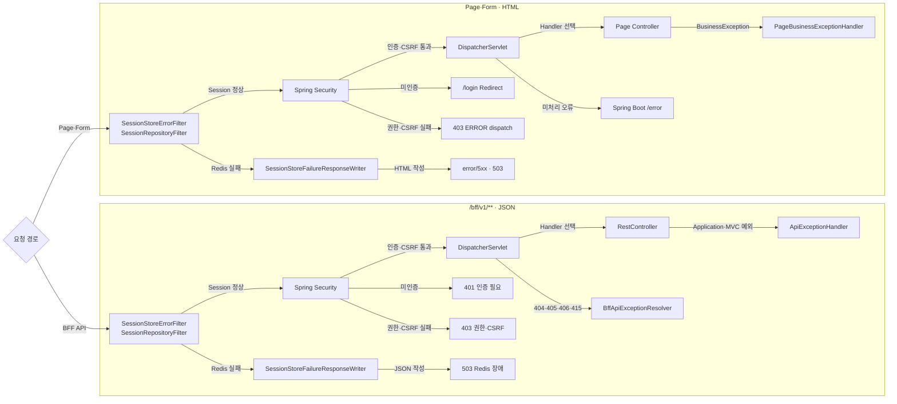
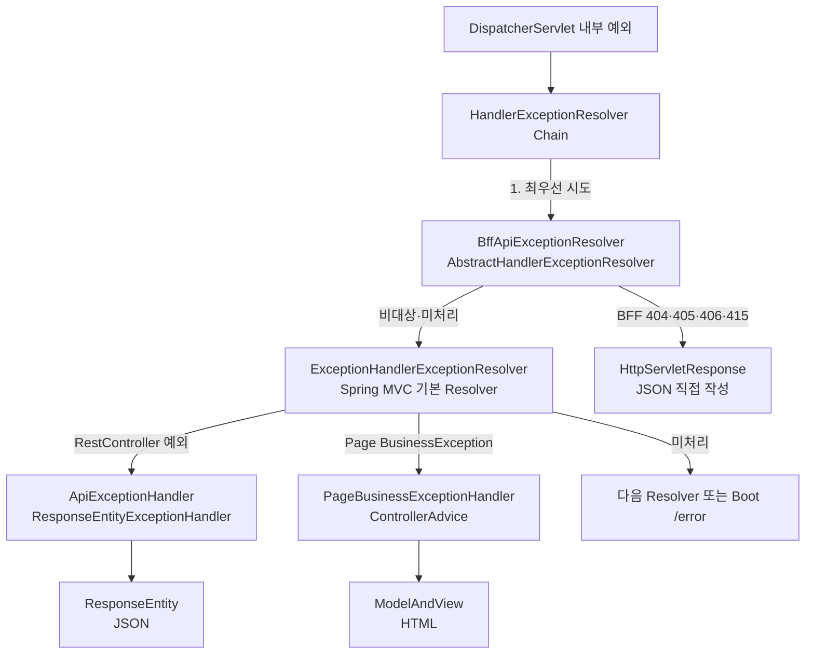
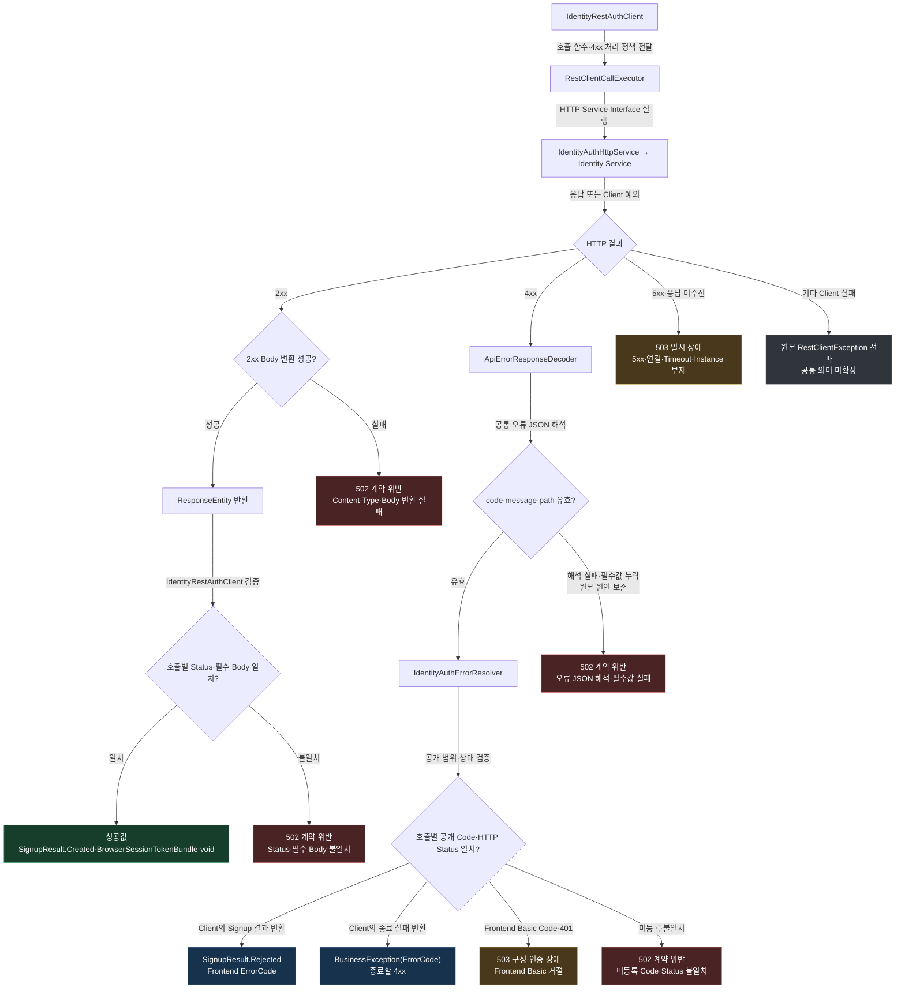

# 오류·장애 흐름

> 상태: Server Form·Page HTML·기능별 BFF 공통 JSON 경계 적용

## 1. 처리 기준

- 기준
  - 오류 의미
  - 발생한 Servlet 단계
  - 응답 형식
- Page 요청
  - HTML 오류 View
  - Login Redirect
  - 같은 Form 재표시
- JSON 요청
  - `ApiErrorResponse`
  - `/bff/v1/**` 기능별 Endpoint
- 단일 `ControllerAdvice` 불가 사유
  - Spring Security: `DispatcherServlet` 이전
  - Spring Session Redis: MVC 이전·반환 이후
  - Form Binding: `BindingResult` 기반 복구
  - Page와 JSON의 응답 형식 차이

## 2. 오류 경계



## 3. 현재 응답 정책

| 요청·실패 | 처리 | 응답 |
|---|---|---|
| 미인증 Page | `LoginUrlAuthenticationEntryPoint` | `/login` Redirect |
| 권한 부족·CSRF | `AccessDeniedHandlerImpl` | HTML 403 ERROR Dispatch |
| Signup 형식 오류 | `BindingResult` | 같은 Form + 400 |
| Signup 중복 | `SignupPageController` | 같은 Form + 409 |
| Page `BusinessException` | `PageBusinessExceptionHandler` | HTML 오류 View |
| 예상하지 못한 Page 오류 | Boot `/error` | HTML 오류 |
| Page Redis Session 장애 | `SessionStoreErrorFilter` → `SessionStoreFailureResponseWriter` | HTML 503 |
| REST `BusinessException` | `ApiExceptionHandler` | JSON 4xx·5xx |
| 하류 Access JWT 인증 실패 | `ApiExceptionHandler` | 인증 Session 폐기 + JSON 401 |
| 예상하지 못한 REST 오류 | `ApiExceptionHandler` | JSON 500 |
| 미인증 BFF | `BffApiSecurityErrorHandler` | JSON 401 |
| BFF 권한·CSRF 실패 | `BffApiSecurityErrorHandler` | JSON 403 |
| BFF Mapping·표현 협상 오류 | `BffApiExceptionResolver` | JSON 404·405·406·415 |
| BFF Redis Session 장애 | `SessionStoreErrorFilter` → `SessionStoreFailureResponseWriter` | JSON 503 |

- 경로 계약
  - Frontend BFF: `/bff/v1/**`
  - Gateway 외부 API: `/api/**`
- 미구현
  - Access Token Refresh·안전한 요청 재실행

## 4. Form 복구

### Binding 오류

```text
잘못된 Signup Form
→ Spring MVC Binding·Bean Validation
→ BindingResult
→ register View
→ HTTP 400
```

- Frontend 확인
  - 필수값
  - 기본 이메일 형식
- Identity 확인
  - 계정·이름·비밀번호 정책
  - 이메일 중복

### Identity 가입 거절

```text
Identity 4xx
→ ApiErrorResponseDecoder
→ IdentityAuthErrorResolver
→ IdentityRestAuthClient
→ SignupResult.Rejected(ErrorCode)
→ AuthenticationService의 변경 없는 전달
→ SignupPageController의 결과 분기
→ authFeedback·HTTP 상태 설정
→ register View + 400/409
```

- 복구 결과
  - `COMMON_INVALID_REQUEST`: Identity 필수값 검증 실패
  - `ACCOUNT_INVALID_EMAIL`: 이메일 정책 위반
  - `ACCOUNT_INVALID_PASSWORD`: 비밀번호 정책 위반
  - `ACCOUNT_INVALID_NAME`: 이름 정책 위반
  - `ACCOUNT_DUPLICATE_EMAIL`: 이메일 중복
- 역할 분리
  - Frontend: 필수값·기본 이메일 형식의 즉시 Form 검증
  - Identity: 이메일·이름·비밀번호 가입 정책의 판정
  - Identity Auth Adapter: 공개 Code·HTTP 상태의 허용 목록 검증
  - Signup Page: Frontend 문구와 동일 Form의 400·409 응답
- Presentation 책임
  - Application 결과의 동일 Form 변환
  - `BindingResult`·HTTP 상태·View 복구
  - Form 재표시 전 Password 제거
- `SignupResult` 경계
  - 소유: Application
  - 사용: Infrastructure Port 구현의 반환값·Presentation의 후속 흐름 선택
  - `Created`: Login Page Redirect 대상
  - `Rejected(ErrorCode)`: 검증된 Frontend 공개 오류와 동일 Form 복구 대상
  - 미포함: Identity 오류 원문·Form·Password·Identity DTO
  - 연동 장애·계약 위반: `BusinessException` 전파

## 5. MVC 예외 처리기

### Resolver Chain에서의 관계



| Component | Spring 확장점 | 실행 시점 | 응답 방식 |
|---|---|---|---|
| `BffApiExceptionResolver` | `AbstractHandlerExceptionResolver` | MVC Resolver Chain의 최우선 | `HttpServletResponse` 작성 + 빈 `ModelAndView` |
| `ApiExceptionHandler` | `ResponseEntityExceptionHandler` + `@RestControllerAdvice` | Spring의 `ExceptionHandlerExceptionResolver` 내부 | `ResponseEntity` JSON |
| `PageBusinessExceptionHandler` | `@ControllerAdvice` + `@ExceptionHandler` | Spring의 `ExceptionHandlerExceptionResolver` 내부 | `ModelAndView` HTML |
| `ServletApiErrorResponseWriter` | Spring MVC Resolver 아님 | Filter·Security Handler·Resolver의 직접 호출 | `HttpServletResponse` JSON |

- 순서 구분
  - `BffApiExceptionResolver#setOrder`: Resolver Bean 간 순서
  - `ApiExceptionHandler`의 `@Order`: ControllerAdvice 간 순서
  - 서로 다른 순서 범위

### `PageBusinessExceptionHandler`

- 대상
  - REST JSON 처리 이후 남은 `BusinessException`
- 책임
  - `ErrorType`의 HTTP 상태 변환
  - 403·404 전용 View 및 그 밖의 4xx·5xx 계열 View 선택
  - `ModelAndView`의 View·상태 동시 지정
- 비대상
  - Form Binding 오류
  - 예상하지 못한 Page 오류
  - Security·Session Filter 오류
- 5xx 구분
  - `BusinessException` 502·503: `error/5xx`
  - 예상하지 못한 500: Boot `/error` → `error/500`

### `ApiExceptionHandler`

- 대상
  - Handler가 선택된 `@RestController`
- 책임
  - `BusinessException`
  - Bean Validation
  - 읽을 수 없는 JSON
  - Spring MVC 예외의 공통 JSON 변환
  - 승인된 하류 `401`의 기존 인증 Session 폐기와 JSON 오류 반환
  - 예상하지 못한 오류의 상세 정보 은닉
- 선택자
  - `@RestControllerAdvice(annotations = RestController.class)`
- 우선순위
  - REST JSON 예외 처리 우선
  - HTML 예외 처리기의 후순위 fallback
- 현재 제한
  - DispatcherServlet 이전의 Security·Session Filter 오류 직접 처리 불가
  - Access Token Refresh 없이 하류 `401`을 재로그인으로 종료

### `BffApiExceptionResolver`

- 대상
  - `/bff/v1/**`
  - Handler Mapping·HTTP 표현 협상의 404·405·406·415
- 책임
  - Spring MVC 상태·Header 보존
  - 공통 JSON 오류 본문 작성
  - 빈 `ModelAndView`로 Resolver 처리 완료 표시
- 비대상
  - 선택된 `@RestController`의 Application·Validation 예외
  - Security·Session Filter 오류

## 6. 오류 본문

```json
{
  "code": "COMMON_INVALID_REQUEST",
  "message": "요청값이 올바르지 않습니다.",
  "path": "/example",
  "requestId": null
}
```

- `code`
  - Client 분기용 오류 식별자
- `message`
  - 사용자 표시용 설명
- `path`
  - 요청 URI
  - HTML 직접 삽입 금지
- `requestId`
  - 목표 추적 식별자
  - 현재 값: 항상 `null`
  - 미구현: Header·MDC·Outbound 전파

## 7. HTTP 상태·Code

| 의미 | Status | Code |
|---|---:|---|
| 잘못된 입력 | 400 | `COMMON_INVALID_REQUEST` |
| 읽을 수 없는 JSON | 400 | `COMMON_MALFORMED_REQUEST` |
| Resource 없음 | 404 | `COMMON_NOT_FOUND` |
| Method 불일치 | 405 | `COMMON_METHOD_NOT_ALLOWED` |
| 응답 형식 불가 | 406 | `COMMON_NOT_ACCEPTABLE` |
| 요청 형식 불가 | 415 | `COMMON_UNSUPPORTED_MEDIA_TYPE` |
| 호출 대상 응답 계약 위반 | 502 | `COMMON_DOWNSTREAM_INVALID_RESPONSE` |
| Identity·Redis 일시 장애 | 503 | `COMMON_SERVICE_UNAVAILABLE` |
| 예상하지 못한 내부 오류 | 500 | `COMMON_INTERNAL_SERVER_ERROR` |

- 단일 상태 기준
  - 실제 HTTP Status
  - Body `status` 없음
- `ErrorHttpMapper`
  - `ErrorType` → `HttpStatus`
  - 일부 Spring MVC Status → `CommonErrorCode`
- 매핑되지 않은 Spring MVC Status
  - 현재 공통 계약 누락으로 판단
  - 원본 예외·상태 Log
  - 상세 정보 없는 JSON 500
  - 새로운 정상 Framework 시나리오 도입 시 매핑 추가 필요

## 8. Identity 실패 변환



- Diagram 판독 기준
  - 위쪽 공통 흐름: Client → 공통 Executor → HTTP Interface
  - 아래쪽 독립 분기: 2xx·4xx·비가용·미분류
  - 녹색: 성공
  - 파란색: 화면에 공개할 수 있는 예상 실패
  - 붉은색: 호출 대상 응답 계약 위반 502
  - 노란색: 일시적 비가용 503

- `RestClientCallExecutor`
  - 4xx의 호출별 결과 복구·예외 변환 위임
  - 5xx·연결·Timeout의 503 변환
  - 성공 Body 해석 실패의 502 변환
  - 분류하지 못한 `RestClientException` 원본 전파
- `ApiErrorResponseDecoder`
  - 공통 오류 JSON 해석
  - `code`·`message`·`path` 필수값 확인
  - 원본 HTTP 예외와 Decode 실패 원인 보존
- `IdentityAuthErrorResolver`
  - 현재 호출이 공개할 수 있는 Code 확인
  - 실제 HTTP 상태와 Code 의미 확인
  - Frontend Basic Credential 실패 분리
- `IdentityRestAuthClient`
  - 호출별 4xx 처리 정책 전달
  - Signup 201·Login 200·Logout 204 확인
  - Login 성공 Body 확인
  - 검증된 4xx의 `SignupResult`·`BusinessException` 변환
  - 성공 응답의 `SignupResult`·`BrowserSessionTokenBundle` 변환

## 9. Identity 실패 표

| Identity 응답·실패 | Frontend 판단 | Browser 결과 |
|---|---|---|
| Signup 입력 오류 + 400 | Form 복구 가능 | Signup Form + 400 |
| 중복 Email + 409 | Form 복구 가능 | Signup Form + 409 |
| 사용자 Credential 거절 + 401 | Login 실패 | `/login?error=true` |
| Frontend Basic Credential 거절 + 401 | Service 구성·인증 장애 | 503 |
| Basic Credential Code의 Status 불일치 | 응답 계약 위반 | 502 |
| Identity 5xx·연결·Timeout | 일시 장애 | 503 |
| 깨진 JSON·모르는 Code·Status 불일치 | 응답 계약 위반 | 502 |
| Logout Identity 실패 | 원본 기록·Local Logout 계속 | `/login` 이동 |

- 공개 오류 제한 목적
  - Identity 내부 오류의 Browser 노출 방지
  - 현재 화면이 처리할 수 없는 오류의 계약 위반 처리
- 정책 소유
  - Identity: API·Error Code·계정 정책
  - Frontend: 현재 화면의 표시·복구 정책

## 10. Redis Session 장애

- 발생 시점
  - Controller 전 Session 조회
  - 응답 종료 시 Session 저장
- 처리 위치
  - `SessionRepositoryFilter` 직전 `SessionStoreErrorFilter`
- 응답 작성
  - `SessionStoreFailureResponseWriter`
  - Redis Session 저장 실패 전에 작성된 본문·Header 초기화
  - Spring Security 기본 보안 Header의 프레임워크 Writer 재적용
  - Page 요청의 `error/5xx` Thymeleaf View 직접 렌더링
  - View 탐색·렌더링 실패 시 classpath fallback HTML 직접 작성
- Spring Boot `/error` 미사용 사유
  - MVC Controller 기반 기본 오류 처리
  - ERROR dispatch의 Spring Session Filter 재진입 가능성
  - Redis 미접속 상태의 동일 장애 반복 가능성
- classpath fallback HTML 목적
  - HTTP 503 상태 자체가 아닌 최소 사용자 안내 본문 보장
  - Thymeleaf와 MVC 오류 경로까지 실패한 경우에만 사용
  - 추가 ERROR dispatch 없는 현재 응답 직접 작성
- 분류 대상
  - `RedisConnectionFailureException`
  - 원인 체인의 `RedisCommandTimeoutException`
- 현재 전제
  - Frontend Redis 사용처의 Spring Session 단일 구성
- 의도적 비대상
  - 원인 없는 `QueryTimeoutException`
  - 일반 `TimeoutException`을 포함한 다른 Data Store 오류
  - 일반 Application Bug
  - 이미 커밋된 응답
- 응답
  - `/bff/v1/**`: 공통 JSON 503
  - 그 외 Page: `error/5xx` View·HTML 503
  - `Cache-Control: no-store`
  - Spring Security 보안 Header 보존
- 알려진 한계
  - Login Token 발급 뒤 Redis 저장 실패의 Refresh Token Family 보상 부재
  - 다른 Redis 사용처 추가 시 Session 장애 오분류 가능성

## 11. Boot ERROR Dispatch

- 발생
  - Spring Security `sendError`
  - 처리되지 않은 Page 예외
- Template 탐색
  1. 정확한 상태 Template: `error/{status}`
  2. 상태 계열 Template: `error/4xx`·`error/5xx`
  3. Spring Boot 기본 오류 응답
- 정확한 상태 Template
  - 403: `error/403.html`
  - 404: `error/404.html`
  - 500: `error/500.html`
- 상태 계열 fallback
  - 그 외 4xx: `error/4xx.html`
  - 그 외 5xx: `error/5xx.html`
- 검증
  - 전용 Template 없는 405·503 ERROR Dispatch의 공통 View Test

## 12. Logging·추적

- 예상 가능한 4xx
  - 기본 Error Stack Trace 없음
- 5xx
  - Error Code
  - Exception Class
  - HTTP Method·Path
  - 원본 Cause·Stack Trace
- Request ID
  - 현재 미구현
  - 목표: Ingress Header·MDC·오류 Body·Outbound Header 동시 전파

## 13. 장애 확인 순서

1. 요청 형식 확인
   - Form·Page·JSON BFF
2. HTTP 확인
   - Status·Content-Type·Redirect
3. 실행 단계 확인
   - Session Filter·Security Filter·MVC
4. 502 확인
   - Identity 응답 Body·Code·Status 계약
5. 503 확인
   - Identity 연결·Discovery·Redis Session 분리
6. 500 확인
   - Error Code·원본 Stack Trace·누락된 Framework 매핑

## 14. 검증 기준

- Controller 내부 예외: HTML·JSON 응답 경계별 MVC Test
- Handler Mapping·표현 협상 오류: Method·Content-Type·Accept를 포함한 BFF Test
- Security 오류: 미인증·권한·CSRF가 Filter Chain에서 돌아오는지 검증
- Redis Session 오류: MVC 진입 전·응답 반환 후 실패를 포함한 Integration Test
- 하류 오류: 공개 Code·HTTP Status·계약 위반·일시 장애의 구분 검증
- 실제 처리기와 Test 파일은 `global/web`, `global/security`, `global/session`,
  기능별 Infrastructure의 현재 코드에서 확인한다.
