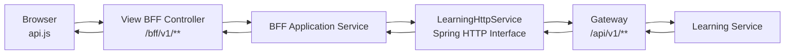

# BFF와 Learning HTTP Interface 경계

> 상태: 현재 구현 설명
>
> 대상: View BFF 또는 Learning API 연동 코드를 수정하는 Frontend·Backend 개발자
>
> 목적: “Browser, View, Learning이 서로 무엇을 알아야 하는가”를 정확히 구분하고,
> `@HttpExchange`·`@GetExchange` 기반 내부 HTTP 호출이 실제로 동작하는 방식을 설명한다.

## 1. 먼저 바로잡을 표현

“View와 Learning이 서로 몰라도 된다”는 표현은 정확하지 않다.

현재 구조를 정확하게 표현하면 다음과 같다.

```text
Browser는 Learning Service의 주소와 API 계약을 몰라도 된다.
View BFF는 자신이 호출하는 Learning 공개 HTTP API 계약을 알아야 한다.
Learning Service는 Browser DOM과 /bff/v1/** 계약을 몰라도 된다.
```

View와 Learning은 Java Class를 직접 공유하거나 상대방 내부 구현을 알 필요는 없지만,
HTTP로 통신하려면 Method, Path, Header, Request Body, Response Body, Status 같은 **공개
HTTP 계약**에는 반드시 합의해야 한다.

| 구성요소 | 알아야 하는 것 | 몰라도 되는 것 |
| --- | --- | --- |
| Browser JavaScript | `/bff/v1/**` Method·요청·화면용 응답·공개 오류 | Gateway 주소, Learning `/api/v1/**`, Access Token, Learning 내부 DTO·DB |
| View BFF | Browser 계약, Learning 공개 HTTP 계약, Session Token 전달 규칙 | Learning Controller·Service·Repository 구현, DB 구조, 내부 예외 Stack Trace |
| Gateway | 외부 Path와 대상 Service Route, 전달할 인증 Header | Browser DOM, 화면 Rendering 방식, Learning 업무 규칙 |
| Learning Service | 자신의 `/api/v1/**` 계약, JWT·업무 규칙·DB | `/bff/v1/**`, React·Thymeleaf 구조, 화면 상태와 CSS |

따라서 두 저장소가 컴파일 의존성을 갖지 않는 것과 런타임 HTTP 계약을 모르는 것은 다른
이야기다. View는 Learning의 Java DTO를 의존하지 않고 View 저장소 안에 Wire DTO를
정의하지만, 그 필드와 JSON 형식은 Learning 응답 계약과 일치해야 한다.

## 2. 현재 호출 경계



세 종류의 경로를 섞지 않는다.

```text
Page:                  /home
Browser → View BFF:    /bff/v1/attendance/history
View → Gateway:        /api/v1/cohorts/{cohortId}/attendance-records/me
```

- `/bff/v1/**`는 화면이 의존하는 View 계약이다.
- `/api/v1/**`는 View 서버가 의존하는 Gateway·Learning 계약이다.
- View BFF는 두 계약 사이에서 인증을 변환하고, 필요한 값을 보완하고, 오류를 정제한다.

## 3. `LearningHttpService`는 무엇인가

`LearningHttpService`는 Controller나 업무 Service가 아니다. View 서버가 Gateway의
Learning API를 호출하기 위해 선언한 **HTTP Client Interface**다.

```java
@HttpExchange("/api/v1")
public interface LearningHttpService {

    @GetExchange("/user-profiles/me/profile")
    UserProfileResponse getMyProfile(
            @RequestHeader(HttpHeaders.AUTHORIZATION) String authorization
    );
}
```

개발자는 Interface와 애노테이션만 작성한다. Spring이 실행 시 구현 객체를 만들어 Bean으로
등록하고, 메서드 호출을 실제 HTTP 요청으로 변환한다.

```text
learningHttpService.getMyProfile("Bearer ...")
                    ↓
GET {gateway-base-url}/api/v1/user-profiles/me/profile
Authorization: Bearer ...
                    ↓
응답 JSON을 UserProfileResponse로 역직렬화
```

이 방식은 OpenFeign을 사용하지 않은 빈자리를 임의 코드로 채운 것이 아니라 Spring의
선언형 HTTP Interface를 선택한 것이다. **BFF는 아키텍처 역할이고, HTTP Interface와
OpenFeign은 그 BFF가 하류 API를 호출하는 구현 수단**이다.

## 4. HTTP Interface 애노테이션

### `@HttpExchange`

Interface 또는 Method의 공통 HTTP 계약을 선언한다.

```java
@HttpExchange("/api/v1")
public interface LearningHttpService {
}
```

현재는 모든 Learning 호출 앞에 `/api/v1`이 붙는다. Host는 이 애노테이션이 아니라
`gateway-service` 설정에서 정한다.

### `@GetExchange`

HTTP `GET` 요청을 선언한다. 조회 전용이며 서버 상태를 변경하면 안 된다.

```java
import org.springframework.web.bind.annotation.RequestParam;

@GetExchange("/cohorts/{cohortId}/attendance-records/me")
AttendanceRecordPageResponse getMyAttendanceRecords(
        @RequestHeader(HttpHeaders.AUTHORIZATION) String authorization,
        @PathVariable Long cohortId,
        @RequestParam(required = false) String from,
        @RequestParam(required = false) String to,
        @RequestParam(required = false) Integer page,
        @RequestParam(required = false) Integer size
        );
```

호출 시 다음 요청이 만들어진다.

```http
GET /api/v1/cohorts/7/attendance-records/me?from=2026-08-01&to=2026-08-31&page=0&size=20
Authorization: Bearer <AccessToken>
```

### `@PostExchange`

생성, 명령 실행 또는 상태 전이를 요청한다.

```java
@PostExchange("/cohorts/{cohortId}/attendance-records/check-in")
AttendanceRecordResponse checkIn(
        @RequestHeader(HttpHeaders.AUTHORIZATION) String authorization,
        @PathVariable Long cohortId
);
```

### `@PutExchange`와 `@PatchExchange`

- `PUT`: 리소스 전체 교체 또는 멱등적인 설정 변경 계약에 사용한다.
- `PATCH`: 닉네임이나 상태처럼 리소스 일부를 변경할 때 사용한다.

실제 의미는 애노테이션 이름만으로 결정하지 않고 Learning REST 계약과 일치시켜야 한다.

### `@DeleteExchange`

리소스 삭제 요청을 선언한다. `ResponseEntity<Void>`를 사용하면 Status와 Header를
확인하면서 빈 Body를 처리할 수 있다.

### Parameter 애노테이션

| 애노테이션 | HTTP에서 변환되는 위치 | 예 |
| --- | --- | --- |
| `@RequestHeader` | Header | `Authorization: Bearer ...` |
| `@PathVariable` | URL Path | `/cohorts/{cohortId}` |
| `@RequestParam` | Query String | `?page=0&size=20` |
| `@RequestBody` | JSON Body | 닉네임 변경 요청 |
| `@RequestPart` | Multipart Part | 게시글 JSON과 첨부파일 |

`@RequestPart`를 사용할 때 Browser의 `FormData`와 View의 Multipart 재전송 계약을 모두
검증해야 한다. 파일명, Content-Type, Part 이름이 Learning 계약과 일치해야 한다.

## 5. Interface 구현체는 어디에서 생기는가

현재 설정은 다음과 같다.

```java
@Configuration(proxyBeanMethods = false)
@ImportHttpServices(
        group = "gateway-service",
        types = LearningHttpService.class
)
public class LearningHttpServiceConfig {
}
```

`@ImportHttpServices`가 `LearningHttpService`의 Proxy 구현을 생성해 Spring Bean으로
등록한다. `group = "gateway-service"`는 다음 설정과 연결된다.

```yaml
spring:
  http:
    serviceclient:
      gateway-service:
        base-url: ${GATEWAY_SERVICE_BASE_URL}
```

최종 URL은 다음처럼 결합된다.

```text
${GATEWAY_SERVICE_BASE_URL}
+ @HttpExchange의 /api/v1
+ @GetExchange 등의 Method Path
```

예를 들어 Base URL이 `http://localhost:8080`이라면 최종 요청은 다음과 같다.

```text
http://localhost:8080/api/v1/user-profiles/me/profile
```

연결·응답 Timeout은 `spring.http.clients`의 공통 설정을 사용한다. 로컬과 운영 환경에서
Base URL은 달라질 수 있지만 Browser 코드와 `/bff/v1/**` 계약은 바뀌지 않는다.

## 6. 프록시인데도 BFF인 이유

`PresenceBffController`처럼 Learning 응답을 거의 그대로 반환하는 Endpoint도 있다.
이 경우 화면용 조합은 적지만 다음 BFF 경계는 여전히 존재한다.

- Browser의 HttpOnly Session Cookie를 View 서버에서 검증한다.
- Redis Session의 Access Token을 내부 Bearer Header로 변환한다.
- Browser에 Gateway 주소와 Access Token을 노출하지 않는다.
- 연결 실패, 잘못된 응답, 하류 4xx·5xx를 View의 공개 오류로 변환한다.
- Browser 계약을 `/bff/v1/**`로 고정해 내부 API 변경의 영향을 제한한다.

따라서 `LearningProxyBffService`의 `Proxy`는 “아무 URL이나 전달하는 범용 Proxy”라는 뜻이
아니다. 허용된 `LearningHttpService` 메서드만 실행하는 인증된 기능 Proxy다.

반면 `AttendanceBffService`와 `ProfileBffService`에는 BFF 조합 책임이 더 명확하다.

| Service | 추가하는 View BFF 책임 |
| --- | --- |
| `AttendanceBffService` | Session Token 조회, 승인 기수 확인, `cohortId` 보완, 오전 4시 서비스 날짜 계산 |
| `ProfileBffService` | Learning Profile과 Session의 사용자 ID 결합 |
| `LearningProxyBffService` | Session Token relay와 공통 하류 실행·오류 경계 |

## 7. 기능별 Controller와 공통 처리의 경계

거대한 `CommonBffController` 하나를 만들지 않는다. Browser API는 기능별로 분리한다.

```text
AttendanceBffController
ProfileBffController
GamificationBffController
CommunityBffController
CohortBffController
RankingBffController
```

공통화할 것은 Controller가 아니라 기반 처리다.

| 기능별로 유지 | 공통화 가능 |
| --- | --- |
| Browser Route와 DTO | Session Token 추출 |
| 화면용 조회 조합 | HTTP Client 설정·Timeout |
| 공개 가능한 업무 `4xx` 선택 | 공통 오류 본문 해석 |
| 기능별 Loading·Empty 결과 | 연결 실패·잘못된 응답 변환 |

Controller는 요청을 받고 Application Service를 호출하는 얇은 입구로 둔다. 핵심 출석,
기수, 퀘스트 규칙은 BFF로 복사하지 않고 Learning Service가 최종 판단한다.

## 8. API가 변경될 때 무엇을 바꾸는가

### Learning 내부 구현만 변경

공개 HTTP 계약이 같다면 View 변경은 없다.

```text
Learning Repository·Table·내부 Service 변경
→ /api/v1 계약 유지
→ View 변경 없음
```

### Learning 공개 HTTP 계약 변경

View의 HTTP Interface와 Wire DTO를 수정해야 한다.

```text
Learning Path·Method·JSON 필드 변경
→ LearningHttpService·Wire DTO 수정
→ BFF 변환·계약 테스트 수정
```

### Browser 화면 계약만 변경

Learning API가 충분한 데이터를 제공한다면 BFF 조합과 Browser DTO만 변경한다.

```text
화면 표시 구조 변경
→ /bff/v1 응답 DTO·api.js·Rendering 수정
→ Learning API 변경 불필요할 수 있음
```

이 분리가 BFF가 제공하는 변경 완충 효과다. View가 Learning의 공개 계약까지 모르는 것이
아니라, Browser와 Learning이 서로의 계약을 직접 의존하지 않게 한다.

## 9. 새 Learning API 연결 체크리스트

- [ ] Learning의 실제 Method·Path·Request·Response·Status를 확인했다.
- [ ] 허용할 업무 `4xx`와 숨길 하류 `5xx`를 합의했다.
- [ ] `LearningHttpService`에 구체적인 메서드만 추가했다.
- [ ] Header·Path Variable·Query·Body·Multipart 애노테이션을 계약과 맞췄다.
- [ ] Browser에는 `/bff/v1/**`만 공개했다.
- [ ] 사용자 ID와 `cohortId`를 Browser 입력으로 신뢰하지 않는다.
- [ ] Session Access Token만 Bearer Header로 전달한다.
- [ ] 성공 응답과 필수 Body 누락·역직렬화 실패를 테스트했다.
- [ ] 연결 실패, 하류 4xx, 하류 5xx 변환을 테스트했다.
- [ ] Browser에 Token, 내부 URL, Stack Trace, 내부 오류 메시지가 노출되지 않는다.

## 10. 최종 요약

```text
Browser는 Learning을 모른다.
Learning은 Browser 화면과 BFF Route를 모른다.
View BFF는 양쪽 공개 계약을 모두 안다.
LearningHttpService는 View가 알고 있는 Learning 공개 HTTP 계약이다.
@GetExchange 등은 그 계약을 실제 HTTP 요청으로 바꾸는 Spring 선언형 Client다.
OpenFeign을 쓰지 않은 것과 BFF가 필요한 이유는 별개의 문제다.
```

전체 버튼 요청 흐름과 오류·CSRF 예시는
[BFF 실제 요청 흐름](04-bff-request-flow.md), 새 기능 구현 절차는
[기능 연동 개발 가이드](05-feature-integration-guide.md)를 함께 참고한다.
