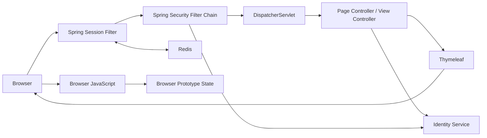

# Frontend 동작 흐름

> 상태: 현재 구현 설명 · 요구사항 정본 아님 · `feature/auth-boundary` 작업 트리 기준

## 1. 범위와 정본

- 목적
  - Browser 요청부터 Spring MVC·Security·Session·Identity 호출까지의 실행 경로 설명
  - 실제 Service 연동과 Browser Prototype의 구분
  - 인증·오류·Session 변경 시 확인할 경계 제공
- 기준
  - 실제 동작: `src/main`
  - 회귀 검증: `src/test`
  - 제품 요구사항: 상위 `docs/10-specifications`
  - 기술 결정: 상위 `docs/30-adr`
  - Service API 계약: 각 Service의 REST Docs·현재 Code
- 비범위
  - 미구현 기능의 확정 API 계약
  - Browser Prototype 데이터의 업무 정본 인정
  - 삭제된 인증 API의 역사 보존

## 2. 한 장 요약



- Browser
  - 설정된 Opaque Session Cookie 보유
  - 로컬 기본 예시: `OMAGOTCHI_SESSION`
  - Access·Refresh Token 원문 미보유
- Spring MVC·Thymeleaf
  - URL·View 연결
  - Signup Form Binding·Validation·Redirect
  - Server Form과 CSRF hidden input 생성
- Spring Security
  - `POST /login`·`POST /logout` 처리
  - Page 인증·인가
  - Session fixation 방어와 SecurityContext 저장
- Spring Session Redis
  - Browser Session·SecurityContext·Identity Token Bundle 저장
- Identity Service
  - 계정 생성
  - 사용자 Credential 검증
  - Access·Refresh Token 발급·폐기
- Browser JavaScript
  - 입력 반응·제출 상태·동적 UI
  - 대부분의 미연동 업무 기능 Prototype
  - 인증·인가 근거로 사용 불가

## 3. 현재 구현 상태

| 영역 | 상태 | 저장·판단 위치 |
|---|---|---|
| Page Routing | 구현 | `WebConfig`, 인증 Page Controller |
| Signup·Login·Logout | Identity 연동 | Identity DB, Spring Session Redis |
| CSRF | 구현 | Spring Security, HTTP Session |
| Page 인증 | 구현 | Redis Session의 SecurityContext |
| 캐릭터·출석·학습·XP | Browser Prototype | `sessionStorage`, `localStorage`, JS Memory |
| 관리자 Dashboard 데이터 | Browser Prototype | Browser 저장소 |
| 관리자 기수 권한 | 미구현 | 향후 Learning 연동 |
| BFF JSON 공통 경계 | 구현 | `/bff/v1/**`, MVC·Security·Redis |
| 기능별 BFF Endpoint | 미구현 | Prototype Adapter만 존재 |
| Access Token Refresh | 미구현 | 없음 |
| 비밀번호 변경·재설정 | 미구현 | 안내 Page만 유지 |

- 지원 인증 Route
  - Signup: `GET·POST /register`
  - Login: `GET·POST /login`
  - Logout: `POST /logout`
- 관리자 Route
  - 지원: `/manager-dashboard`
  - 현재 보호: 인증 여부만 확인
  - 미등록 레거시 파일: `managerLogin.*`, `managerRegister.*`
  - 레거시 파일의 상태: 동작하는 Route·API 없는 제거 대상
- 캐릭터 표시명 Route
  - 경로: `/username`
  - 상태: Learning 게임 프로필 연동 전 Browser Prototype
  - Identity 이름·권한 근거: 아님
- Prototype 업무 API Adapter
  - 파일: `static/js/api.js`
  - 경로: Frontend `/bff/v1/**`
  - 실패 정책: Browser Prototype fallback
  - BFF 구현 완료 근거: 아님

## 4. 문서 순서

1. [Servlet Container와 Spring Container](00-servlet-container-and-spring-container.md)
   - Embedded Tomcat, Filter Chain, Spring Bean, `DispatcherServlet` 경계
2. [요청·Page·JavaScript 흐름](01-request-page-and-browser-flow.md)
   - Route, View, Browser Module과 Prototype 상태
3. [Session 인증 흐름](02-session-authentication-flow.md)
   - Signup·Login·Logout, Redis와 Identity 경계
4. [오류·장애 흐름](03-error-and-failure-flow.md)
   - HTML·JSON 오류 경계, Identity·Redis 실패
5. [BFF 실제 요청 흐름](04-bff-request-flow.md)
   - Browser·BFF·Gateway·Learning 역할과 출결·Presence·첨부파일 처리 순서
6. [기능 연동 개발 가이드](05-feature-integration-guide.md)
   - Prototype 전환, SSR·JSON BFF 선택, Session·CSRF·내부 HTTP·검증 기준
7. [BFF와 Learning HTTP Interface 경계](06-bff-http-interface-boundary.md)
   - Browser·View·Learning의 의존 범위와 `@HttpExchange`·`@GetExchange` 동작 방식

## 5. Code 탐색 시작점

```text
src/main/java/site/omagotchi/frontend
├── auth
│   ├── presentation/page       인증 Page·Form
│   ├── presentation/security   Spring Security 확장점
│   ├── application             인증 Use Case 경계
│   ├── domain                  Frontend 전역 Role
│   └── infrastructure          Identity HTTP Client
└── global
    ├── config                  MVC 설정
    ├── security                Page 보안 정책
    ├── session                 Redis Session 장애 경계
    ├── http                    Outbound HTTP 공통 처리
    ├── web                     Inbound Servlet·MVC 응답 경계
    └── exception               공통 오류 계약
```

## 6. 변경 확인표

- Page Route 변경
  - `WebConfig`
  - `SecurityConfig`
  - 대상 Template·JavaScript
  - Route Test
- 인증 변경
  - `02-session-authentication-flow.md`
  - Spring Security 확장점
  - Identity Client 계약
  - Redis Session Test
- 오류 변경
  - `03-error-and-failure-flow.md`
  - `ApiExceptionHandler`
  - `PageBusinessExceptionHandler`
  - `SessionStoreErrorFilter`
- 기능별 BFF 추가
  - 외부 URL·Ingress 계약
  - Session Access JWT relay·Refresh
  - 기능별 JSON 업무 오류 정책
  - Domain Service 권한 확인
