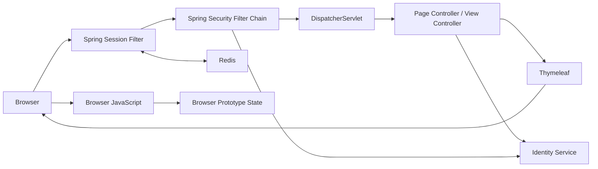

# Frontend 동작 흐름

> 상태: 현재 동작 흐름 설명 · 요구사항 정본 아님

## 1. 범위와 정본

- 목적
  - Browser 요청부터 Spring MVC·Security·Session·Identity 호출까지의 실행 경로 설명
  - 실제 Service 연동과 Browser Prototype의 구분
  - 인증·오류·Session 변경 시 확인할 경계 제공
- 기준
  - 실제 동작: `src/main`
  - 회귀 검증: `src/test`
  - 제품 요구사항: 상위 `docs/10-specifications`
  - 기술 결정: 상위 `docs/30-adr`
  - Service API 계약: 각 Service의 REST Docs·현재 Code
- 비범위
  - 미구현 기능의 확정 API 계약
  - Browser Prototype 데이터의 업무 정본 인정
  - 삭제된 인증 API의 역사 보존

## 2. 한 장 요약



- Browser
  - 설정된 Opaque Session Cookie 보유
  - 로컬 기본 예시: `OMAGOTCHI_SESSION`
  - Access·Refresh Token 원문 미보유
- Spring MVC·Thymeleaf
  - URL·View 연결
  - Signup Form Binding·Validation·Redirect
  - Server Form과 CSRF hidden input 생성
- Spring Security
  - `POST /login`·`POST /logout` 처리
  - Page 인증·인가
  - Session fixation 방어와 SecurityContext 저장
- Spring Session Redis
  - Browser Session·SecurityContext·Identity Token Bundle 저장
- Identity Service
  - 계정 생성
  - 사용자 Credential 검증
  - Access·Refresh Token 발급·폐기
  - 인증 사용자 계정 조회·이름·비밀번호 변경
- Browser JavaScript
  - 입력 반응·제출 상태·동적 UI
  - 대부분의 미연동 업무 기능 Prototype
  - 인증·인가 근거로 사용 불가

## 3. 구현 상태 확인 방법

이 문서는 Route 개수나 기능별 Controller 목록을 별도로 유지하지 않는다. 변경이 잦은
구현 현황은 아래 위치에서 확인한다.

- Page Route: `WebConfig`, `@Controller`, `SecurityConfig`
- Browser BFF Route: `@RestController`의 `/bff/v1/**` Mapping과 `static/js/api.js`
- 내부 호출: 기능별 Application Port·Client와 대상 Service의 REST Docs
- 인증·Session 회귀: Security MVC Test와 Redis Integration Test
- 기능 완료·미구현 현황: 관련 Issue·Roadmap

온보딩 문서에서는 다음 경계만 지속적으로 유지한다.

- Browser는 Opaque Session Cookie만 보관하고 Token 원문을 취급하지 않는다.
- Browser 전용 JSON 계약은 `/bff/v1/**`을 사용한다.
- Frontend BFF는 Session의 Access JWT를 하류 호출 인증으로 변환하고 화면용 계약을 소유한다.
- Frontend BFF는 담당 Domain Service를 직접 호출한다. AI Chat은 후속 전환 전까지 Gateway를 사용한다.
- Page·JSON·Security·Session 오류 경계를 서로 구분한다.

## 4. 문서 순서

1. [Servlet Container와 Spring Container](00-servlet-container-and-spring-container.md)
   - Embedded Tomcat, Filter Chain, Spring Bean, `DispatcherServlet` 경계
2. [요청·Page·JavaScript 흐름](01-request-page-and-browser-flow.md)
   - Route, View, Browser Module과 Prototype 상태
3. [Session 인증 흐름](02-session-authentication-flow.md)
   - Signup·Login·Logout, Redis와 Identity 경계
4. [오류·장애 흐름](03-error-and-failure-flow.md)
   - HTML·JSON 오류 경계, Identity·Redis 실패
5. [BFF 실제 요청 흐름](04-bff-request-flow.md)
   - Browser·BFF·Learning 역할과 출결·Presence·첨부파일 처리 순서
6. [기능 연동 개발 가이드](05-feature-integration-guide.md)
   - Prototype 전환, SSR·JSON BFF 선택, Session·CSRF·내부 HTTP·검증 기준
7. [BFF와 Learning HTTP Interface 경계](06-bff-http-interface-boundary.md)
   - Browser·View·Learning의 의존 범위와 `@HttpExchange`·`@GetExchange` 동작 방식
8. [새 기능 BFF 연결 Quick Start](07-bff-feature-quickstart.md)
   - API 계약 확인부터 Controller·HTTP Client·`api.js`·오류·테스트까지의 실전 연결 순서

## 5. Code 탐색 시작점

```text
src/main/java/site/omagotchi/frontend
├── auth
│   ├── presentation/page       인증 Page·Form
│   ├── presentation/security   Spring Security 확장점
│   ├── application             인증 Use Case 경계
│   ├── domain                  Frontend 전역 Role
│   └── infrastructure          Identity HTTP Client
└── global
    ├── config                  MVC 설정
    ├── security                Page 보안 정책
    ├── session                 Redis Session 장애 경계
    ├── http                    Outbound HTTP 공통 처리
    ├── web                     Inbound Servlet·MVC 응답 경계
    └── exception               공통 오류 계약
```

## 6. 변경 확인표

- Page Route 변경
  - `WebConfig`
  - `SecurityConfig`
  - 대상 Template·JavaScript
  - Route Test
- 인증 변경
  - `02-session-authentication-flow.md`
  - Spring Security 확장점
  - Identity Client 계약
  - Redis Session Test
- 오류 변경
  - `03-error-and-failure-flow.md`
  - `ApiExceptionHandler`
  - `PageBusinessExceptionHandler`
  - `SessionStoreErrorFilter`
- 기능별 BFF 추가
  - 외부 URL·Ingress 계약
  - Session Access JWT relay
  - 기능별 JSON 업무 오류 정책
  - Domain Service 권한 확인
- Access Token Refresh 추가
  - `02-session-authentication-flow.md`
  - Identity Refresh Client 계약
  - Redis Session Token 묶음 교체
  - Session 단위 동시 갱신 회귀 검증
