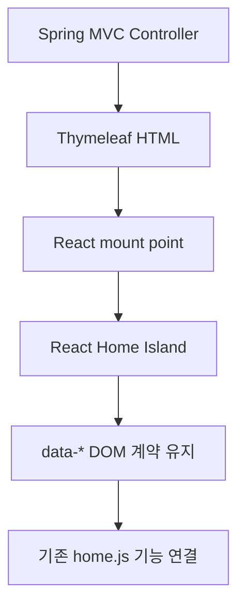

# React Island 점진 이전 학습 및 작업 로드맵

- 상태: 작업 계획 — 점진 이전 진행 중

## 목적

이 문서는 현재 Omagotchi 프론트엔드를 React로 한 번에 전환하지 않고, 기존 Spring MVC + Thymeleaf + Vanilla JS 구조 위에서 React island 방식으로 점진 이전하기 위해 무엇을 공부하고 어떤 순서로 작업해야 하는지 정리한다.

현재 목표는 "React를 도입했다"가 아니라, Home처럼 화면 비율과 UI 상태가 복잡한 화면을 컴포넌트 단위로 정리해 유지보수 가능한 구조로 바꾸는 것이다.

## 현재 선택한 방향

- 전체 SPA 전환은 하지 않는다.
- `/home` 단일 진입점은 유지한다.
- 인증, 인가, JWT, 세션, 로그인 성공 redirect는 건드리지 않는다.
- React는 화면 일부를 렌더링하는 island로 사용한다.
- 기존 `home.js`가 사용하는 `data-*` DOM 계약은 당분간 유지한다.
- Backend API 호출은 React 컴포넌트 안에 직접 흩뿌리지 않고 API/helper 계층으로 분리한다.
- 모바일 전용 `/mobile/home` 경로 분기는 사용하지 않는다.

## 지금 해야 할 일

### 1. React 기본 문법 학습

우선 다음 개념을 알아야 한다.

- JSX
- Component
- props
- state
- event handler
- conditional rendering
- list rendering
- `useState`
- `useEffect`
- controlled input
- component composition

여기서 중요한 것은 React 문법을 많이 아는 것이 아니라, 기존 DOM 조작을 어떤 컴포넌트 상태로 바꿀 수 있는지 이해하는 것이다.

### 2. 기존 Vanilla JS와 React의 차이 이해

기존 방식:

```js
const timer = document.querySelector("[data-timer-display]");
timer.textContent = "00:01:00";
timer.classList.add("is-running");
```

React 방식:

```jsx
function Timer({ elapsedText, running }) {
    return (
        <div className={running ? "timer is-running" : "timer"}>
            {elapsedText}
        </div>
    );
}
```

차이점은 다음과 같다.

| 구분 | Vanilla JS | React |
| --- | --- | --- |
| 화면 변경 방식 | DOM을 직접 찾고 수정 | 상태가 바뀌면 UI를 다시 렌더링 |
| 구조 관리 | HTML 문자열, querySelector, classList 중심 | 컴포넌트와 props 중심 |
| 상태 위치 | 전역 변수, DOM dataset, localStorage에 섞이기 쉬움 | component state 또는 service state로 모으기 쉬움 |
| 장점 | 작고 단순한 기능은 빠르게 구현 가능 | 복잡한 UI 상태와 조건 렌더링 관리에 유리 |
| 단점 | 화면이 커질수록 이벤트와 DOM 관계 추적이 어려움 | 빌드 과정과 상태 설계가 필요 |

## React의 장점

- UI를 의미 있는 단위로 쪼갤 수 있다.
- 같은 UI 패턴을 컴포넌트로 재사용할 수 있다.
- 상태에 따라 화면을 바꾸는 코드가 명확해진다.
- 모바일, 태블릿, PC처럼 배치가 달라져도 같은 데이터와 같은 컴포넌트 구조를 유지할 수 있다.
- 오버레이, 타이머, 채팅, 도크처럼 열림/닫힘/로딩/실패 상태가 있는 UI를 관리하기 쉽다.
- API 응답을 화면 상태로 매핑하는 흐름을 분리하기 좋다.

## React의 단점

- 빌드 도구가 필요하다.
- 단순한 정적 페이지에는 과할 수 있다.
- 기존 Vanilla JS와 함께 쓰는 동안에는 DOM 계약 순서를 조심해야 한다.
- 컴포넌트 안에 API 호출, 스타일 조건, 데이터 변환을 모두 넣으면 오히려 더 복잡해진다.
- 상태 위치를 잘못 잡으면 props drilling이나 중복 state 문제가 생긴다.

따라서 이 프로젝트에서는 전체 전환이 아니라 Home, Overlay, Character Select처럼 상태와 배치가 복잡한 사용자 화면부터 React island로 옮긴다.

## React Island 방식의 의미

React island는 페이지 전체를 React 앱으로 만드는 것이 아니다.

현재 구조:



즉, 서버는 기존처럼 HTML shell을 내려주고, 특정 영역만 React가 렌더링한다.

이 방식의 장점:

- 기존 인증/인가/라우팅을 유지할 수 있다.
- 기존 기능 JS를 한 번에 버리지 않아도 된다.
- UI 구조만 먼저 정리할 수 있다.
- 기능 단위로 안전하게 React 상태로 옮길 수 있다.

주의할 점:

- React가 렌더링하는 DOM을 기존 JS가 바로 찾는다면 React bundle이 먼저 로드되어야 한다.
- 기존 `data-*` 속성을 제거하면 기존 기능이 끊긴다.
- 같은 DOM을 React와 Vanilla JS가 동시에 수정하면 충돌할 수 있다.

## 모바일과 화면 비율 대응 학습

현재 문제는 특정 모바일 기기 하나가 아니라 화면 비율 전체에 대한 대응이다.

좋지 않은 접근:

- iPhone 1개 수치에 맞춰 CSS 작성
- Android 1개 수치에 맞춰 CSS 작성
- DevTools에서 예뻐 보이는 width 하나만 기준으로 조정
- 깨질 때마다 `@media (width: 390px)` 같은 규칙 추가
- `/mobile/home`처럼 별도 경로를 만들어 같은 기능을 두 번 관리

지향하는 접근:

- 화면을 `mobile / tablet / laptop / desktop`보다 먼저 `사용 가능한 폭과 높이`로 판단한다.
- 요소마다 최소값, 선호값, 최대값을 둔다.
- 고정 px보다 `clamp()`, `%`, `min()`, `max()`, `fr`, `aspect-ratio`를 우선한다.
- 세로형, 가로형, 낮은 높이 화면을 별도 레이아웃 모드로 본다.
- 중요한 버튼은 safe area와 하단 도크 충돌을 피한다.
- 텍스트는 부모 안에서 줄바꿈, 말줄임, 크기 제한을 가져야 한다.

예시:

```css
.home-stage {
    width: min(100%, 1280px);
    min-height: 100svh;
    padding: clamp(16px, 4vw, 48px);
}

.timer-display {
    font-size: clamp(48px, 12vw, 120px);
    line-height: 1;
}

.bottom-hud {
    width: min(100%, 520px);
}
```

## 화면 비율별 검증 기준

기기 모델명보다 CSS viewport 기준으로 검증한다.

| 목적 | 기준 |
| --- | --- |
| 작은 세로 화면 | 320 x 568 |
| 일반 모바일 세로 | 360 x 780 |
| iPhone 계열 세로 | 375 x 812 |
| 현대 모바일 세로 | 390 x 844 |
| 큰 모바일 세로 | 412 x 892 |
| 모바일 가로 | 568 x 320 |
| Android 가로 | 780 x 360 |
| 큰 모바일 가로 | 844 x 390 |
| 작은 태블릿/접힌 화면 | 768 x 1024 |
| 노트북 | 1280 x 720 |
| 일반 데스크톱 | 1440 x 900 |

검증할 항목:

- 상단 로고와 메뉴가 겹치지 않는가
- 타이머 숫자가 화면 밖으로 나가지 않는가
- 캐릭터가 하단 HUD와 겹치지 않는가
- 닉네임과 레벨이 한 줄에서 뒤섞이지 않는가
- 경험치 바가 버튼 도크와 겹치지 않는가
- 채팅 입력이 카드처럼 과하게 커지지 않는가
- 오버레이 제목, 탭, 본문이 겹치지 않는가
- 하단 버튼이 safe area 안에서 눌릴 수 있는가

## 앞으로의 이전 순서

### 1단계: Home UI 껍데기 정리

현재 진행 중인 단계다.

- Header
- TopMenu
- TimerPanel
- CharacterStage
- XP HUD
- ChatBar
- ActionDock

이 단계에서는 기존 기능 로직을 유지하고, React가 DOM 구조를 렌더링한다.

### 2단계: Overlay UI 컴포넌트화

다음 대상이다.

- 도움말
- 진행
- 내 정보
- 기수
- 학습 기록
- 공간
- 커뮤니티
- 설정

원칙:

- `data-home-overlay` 진입 계약은 유지한다.
- 오버레이 내부 UI만 React 컴포넌트로 옮긴다.
- API 호출은 컴포넌트에서 직접 하지 않고 helper/service를 둔다.
- 로딩, 빈 상태, 실패 상태를 반드시 UI에 둔다.

### 3단계: 기능 단위 상태 이전

기존 `home.js`에서 UI 상태와 강하게 묶인 부분부터 옮긴다.

우선순위:

1. 오버레이 열림/닫힘 상태
2. BGM 패널 표시 상태
3. 재실 인원 패널 표시 상태
4. 출석부 월 이동 상태
5. 타이머 표시 상태
6. 캐릭터 표시 상태

주의할 점:

- 타이머 기록의 정본은 Backend다.
- 출석 상태의 정본도 Backend다.
- React state는 화면 표시용이지 서버 상태를 대체하지 않는다.

### 4단계: Character Select 화면

캐릭터 선택 화면은 모바일에서 화면 밀도가 높고, 색상 선택, 캐릭터 선택, 미리보기, 닉네임 입력 같은 상태가 많다.

React로 옮기기 좋은 이유:

- 선택 상태를 컴포넌트 state로 관리하기 쉽다.
- 모바일/태블릿/PC 배치를 같은 데이터로 다르게 보여줄 수 있다.
- 선택 완료 전 검증, 로딩, 실패 상태를 표현하기 쉽다.

### 5단계: Login / Signup 카드

로그인과 회원가입은 인증 로직을 건드리지 않고, 카드 UI와 입력 상태만 정리한다.

주의:

- 인증 redirect 정책은 서버 설정을 따른다.
- JWT, session, security config는 프론트 리팩토링 범위가 아니다.
- React로 바꾼다고 토큰을 브라우저 저장소에 직접 저장하지 않는다.

## 공부할 때 우선순위

먼저 볼 것:

1. JSX와 컴포넌트
2. props와 state
3. 조건부 렌더링
4. 리스트 렌더링
5. 이벤트 처리
6. `useEffect`
7. controlled input
8. CSS module이 아니라 현재는 기존 CSS className 연결 방식
9. API helper 분리
10. 반응형 CSS의 `clamp`, `min`, `max`, `aspect-ratio`

나중에 봐도 되는 것:

- Next.js
- React Router
- Redux
- Zustand
- Server Component
- CSS-in-JS
- 복잡한 상태 관리 라이브러리

현재 프로젝트에서는 이 기술들이 아직 필요하지 않다.

## 작업할 때 지킬 규칙

- React 전환을 이유로 기존 기능을 새로 만들지 않는다.
- 인증/인가 코드를 건드리지 않는다.
- 백엔드 API 명세에 없는 데이터를 상상해서 만들지 않는다.
- 하나의 PR에서 화면 구조, API 연동, 인증 흐름을 동시에 바꾸지 않는다.
- React 컴포넌트는 UI 구조와 상태 표현에 집중한다.
- API 호출은 `api.js` 또는 기능별 service/helper로 분리한다.
- `data-*` 계약을 제거할 때는 기존 JS에서 더 이상 사용하지 않는지 확인한다.
- 모바일 대응은 기기명 기준이 아니라 화면 비율과 사용 가능한 공간 기준으로 한다.

## 다음 작업 체크리스트

- [ ] Home React island가 기존 기능과 충돌하지 않는지 확인
- [ ] 하단 HUD, 채팅, 도크 버튼의 세로/가로 화면 대응 확인
- [ ] 오버레이 UI를 React 컴포넌트로 옮길 단위 확정
- [ ] `home.js`에서 DOM 문자열로 만드는 오버레이를 컴포넌트 후보로 분류
- [ ] Timer API 연동 시 React UI와 API helper 경계 유지
- [ ] Space/Team API 연동 시 `data-space-room-app` 계약 유지
- [ ] Character Select 화면을 React island 후보로 설계
- [ ] Login/Signup 카드의 모바일 대응 기준 정리
- [ ] viewport별 QA 체크리스트를 실제 테스트 항목으로 분리

## 관련 문서

- [Frontend 구현 명세](frontend-implementation-spec.md)
- [Home UI React Island 리팩토링 기록](mobile/mobile-view-research.md)
- [Home UI 전환 검토 기록](mobile/home-ui-decision-history.md)
- [Timer Backend 연동 Prompt](prompt/타이머.md)
- [Space·Team Backend 연동 Prompt](prompt/공간-팀.md)
